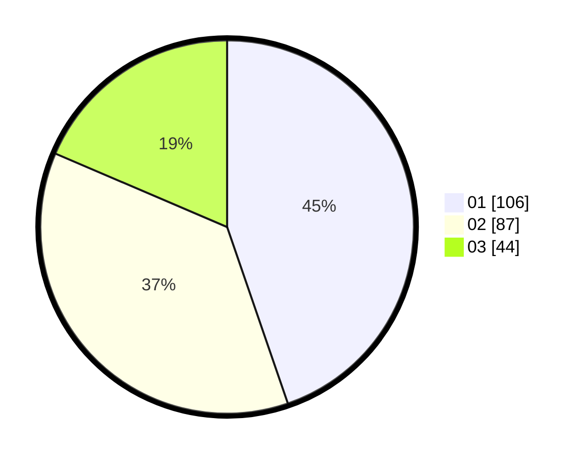

# Hasil

Hasil perolehan suara paslon dapat dilihat pada file paslon-01.txt, paslon-02.txt, dan paslon-03.txt.

Jika tidak ada, artinya data tersebut belum ada pada SIREKAP.

## Perolehan Suara

 * Paslon 01: **106**.
 * Paslon 02: **87**.
 * Paslon 03: **44**.

## Foto C Plano

https://sirekap-obj-formc.kpu.go.id/d587/pemilu/ppwp/31/75/02/10/02/3175021002100-20240214-185554--b98e1309-3307-4255-9784-100973603cc7.jpg

https://sirekap-obj-formc.kpu.go.id/d587/pemilu/ppwp/31/75/02/10/02/3175021002100-20240214-185720--6fd0af3e-1127-472e-8de8-276bd5bbde61.jpg

https://sirekap-obj-formc.kpu.go.id/d587/pemilu/ppwp/31/75/02/10/02/3175021002100-20240214-185914--e261f01e-c20f-478f-95cb-a2e934e07139.jpg

## DATA PEMILIH TETAP

Jumlah pemilih dalam DPT: **285**.
 * L: **135**.
 * P: **150**.

## DATA PENGGUNA HAK PILIH

Jumlah pengguna hak pilih dalam DPT: **236**.
 * L: **111**.
 * P: **125**.

Jumlah pengguna hak pilih dalam DPTb: **3**.
 * L: **2**.
 * P: **1**.

Jumlah pengguna hak pilih dalam DPK: **0**.
 * L: **0**.
 * P: **0**.

Jumlah pengguna hak pilih: **239**.
 * L: **113**.
 * P: **126**.

## JUMLAH SUARA SAH DAN TIDAK SAH

JUMLAH SELURUH SUARA SAH: **237**.

JUMLAH SUARA TIDAK SAH: **2**.

JUMLAH SELURUH SUARA SAH DAN SUARA TIDAK SAH: **239**.
