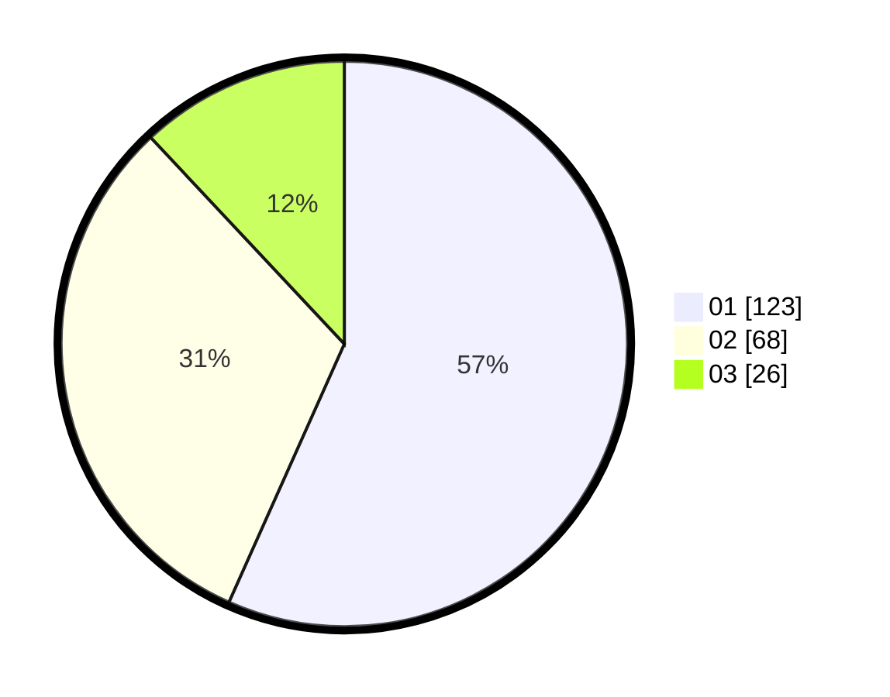

# Hasil

Hasil perolehan suara paslon dapat dilihat pada file paslon-01.txt, paslon-02.txt, dan paslon-03.txt.

Jika tidak ada, artinya data tersebut belum ada pada SIREKAP.

## Perolehan Suara

 * Paslon 01: **123**.
 * Paslon 02: **68**.
 * Paslon 03: **26**.

## Foto C Plano

https://sirekap-obj-formc.kpu.go.id/90b2/pemilu/ppwp/31/75/02/10/02/3175021002102-20240215-013910--181f99cb-a357-4853-8b37-8c51bb624615.jpg

https://sirekap-obj-formc.kpu.go.id/90b2/pemilu/ppwp/31/75/02/10/02/3175021002102-20240215-014021--270f9106-b356-42ff-8aca-d5b82f754a98.jpg

https://sirekap-obj-formc.kpu.go.id/90b2/pemilu/ppwp/31/75/02/10/02/3175021002102-20240215-014332--1f877f71-8652-464e-b7b4-ea4e8002bdc2.jpg

## DATA PEMILIH TETAP

Jumlah pemilih dalam DPT: **268**.
 * L: **130**.
 * P: **138**.

## DATA PENGGUNA HAK PILIH

Jumlah pengguna hak pilih dalam DPT: **215**.
 * L: **98**.
 * P: **117**.

Jumlah pengguna hak pilih dalam DPTb: **3**.
 * L: **2**.
 * P: **1**.

Jumlah pengguna hak pilih dalam DPK: **0**.
 * L: **0**.
 * P: **0**.

Jumlah pengguna hak pilih: **218**.
 * L: **100**.
 * P: **118**.

## JUMLAH SUARA SAH DAN TIDAK SAH

JUMLAH SELURUH SUARA SAH: **217**.

JUMLAH SUARA TIDAK SAH: **1**.

JUMLAH SELURUH SUARA SAH DAN SUARA TIDAK SAH: **218**.
