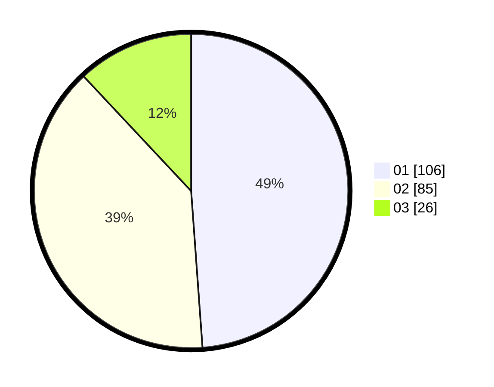

# Hasil

Hasil perolehan suara paslon dapat dilihat pada file paslon-01.txt, paslon-02.txt, dan paslon-03.txt.

Jika tidak ada, artinya data tersebut belum ada pada SIREKAP.

## Perolehan Suara

 * Paslon 01: **106**.
 * Paslon 02: **85**.
 * Paslon 03: **26**.

## Foto C Plano

https://sirekap-obj-formc.kpu.go.id/366f/pemilu/ppwp/31/75/02/10/02/3175021002104-20240214-235627--b020a37d-333c-41f4-91ef-b06f47da0a5f.jpg

https://sirekap-obj-formc.kpu.go.id/366f/pemilu/ppwp/31/75/02/10/02/3175021002104-20240215-000125--4285b207-e260-4623-83fc-cf71cbfee485.jpg

https://sirekap-obj-formc.kpu.go.id/366f/pemilu/ppwp/31/75/02/10/02/3175021002104-20240215-000535--17f3ec0e-219d-43a1-a75c-e56cc534ff99.jpg
