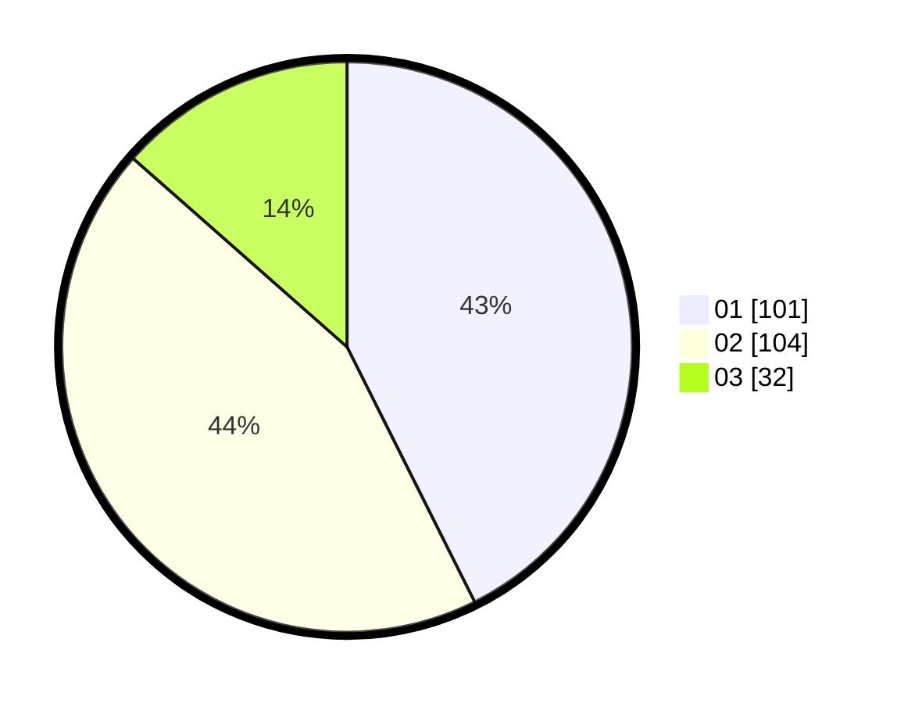

# Hasil

Hasil perolehan suara paslon dapat dilihat pada file paslon-01.txt, paslon-02.txt, dan paslon-03.txt.

Jika tidak ada, artinya data tersebut belum ada pada SIREKAP.

## Perolehan Suara

 * Paslon 01: **101**.
 * Paslon 02: **104**.
 * Paslon 03: **32**.

## Foto C Plano

https://sirekap-obj-formc.kpu.go.id/23c1/pemilu/ppwp/31/75/02/10/02/3175021002105-20240219-191731--af06b943-1975-4f08-a2fe-57712bd11f69.jpg

https://sirekap-obj-formc.kpu.go.id/23c1/pemilu/ppwp/31/75/02/10/02/3175021002105-20240219-193452--a76ce776-fe85-442c-948d-837eaae7d9f0.jpg

https://sirekap-obj-formc.kpu.go.id/23c1/pemilu/ppwp/31/75/02/10/02/3175021002105-20240219-193657--17c1cb38-f578-4c56-8065-dec1fe5f3459.jpg

## DATA PEMILIH TETAP

Jumlah pemilih dalam DPT: **286**.
 * L: **142**.
 * P: **144**.

## DATA PENGGUNA HAK PILIH

Jumlah pengguna hak pilih dalam DPT: **243**.
 * L: **114**.
 * P: **129**.

Jumlah pengguna hak pilih dalam DPTb: **0**.
 * L: **0**.
 * P: **0**.

Jumlah pengguna hak pilih dalam DPK: **0**.
 * L: **0**.
 * P: **0**.

Jumlah pengguna hak pilih: **243**.
 * L: **114**.
 * P: **129**.

## JUMLAH SUARA SAH DAN TIDAK SAH

JUMLAH SELURUH SUARA SAH: **237**.

JUMLAH SUARA TIDAK SAH: **6**.

JUMLAH SELURUH SUARA SAH DAN SUARA TIDAK SAH: **243**.
