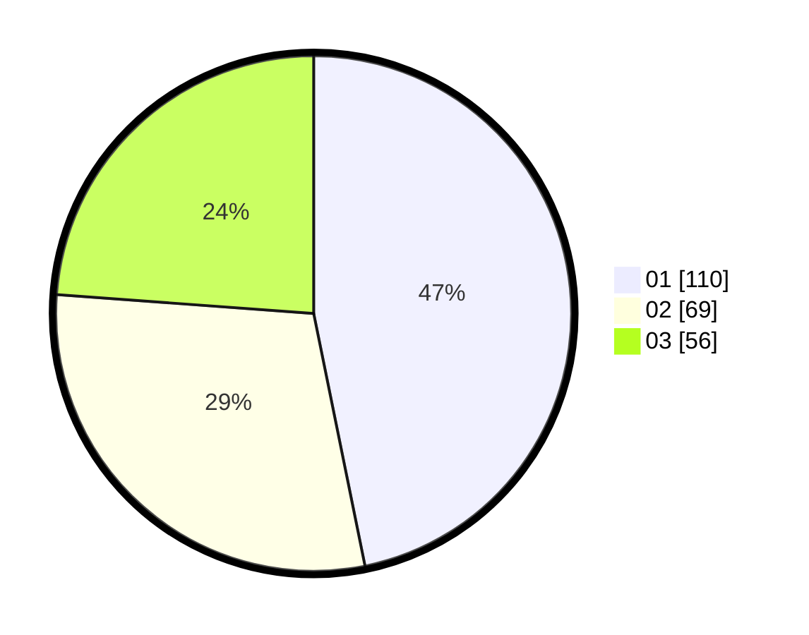

# Hasil

Hasil perolehan suara paslon dapat dilihat pada file paslon-01.txt, paslon-02.txt, dan paslon-03.txt.

Jika tidak ada, artinya data tersebut belum ada pada SIREKAP.

## Perolehan Suara

 * Paslon 01: **110**.
 * Paslon 02: **69**.
 * Paslon 03: **56**.

## Foto C Plano

https://sirekap-obj-formc.kpu.go.id/dbe4/pemilu/ppwp/31/75/02/10/02/3175021002108-20240216-051356--8d34e5cb-cc94-4cbc-abd5-c25331aba9c5.jpg

https://sirekap-obj-formc.kpu.go.id/dbe4/pemilu/ppwp/31/75/02/10/02/3175021002108-20240216-051404--968c8551-eb8c-4c09-bdf6-93aa8b8c6c0d.jpg

https://sirekap-obj-formc.kpu.go.id/dbe4/pemilu/ppwp/31/75/02/10/02/3175021002108-20240216-051359--f3f5d1ee-584f-4817-ad5a-3317e22e6317.jpg

## DATA PEMILIH TETAP

Jumlah pemilih dalam DPT: **288**.
 * L: **133**.
 * P: **155**.

## DATA PENGGUNA HAK PILIH

Jumlah pengguna hak pilih dalam DPT: **238**.
 * L: **105**.
 * P: **133**.

Jumlah pengguna hak pilih dalam DPTb: **2**.
 * L: **0**.
 * P: **2**.

Jumlah pengguna hak pilih dalam DPK: **0**.
 * L: **0**.
 * P: **0**.

Jumlah pengguna hak pilih: **240**.
 * L: **105**.
 * P: **135**.

## JUMLAH SUARA SAH DAN TIDAK SAH

JUMLAH SELURUH SUARA SAH: **235**.

JUMLAH SUARA TIDAK SAH: **5**.

JUMLAH SELURUH SUARA SAH DAN SUARA TIDAK SAH: **240**.
