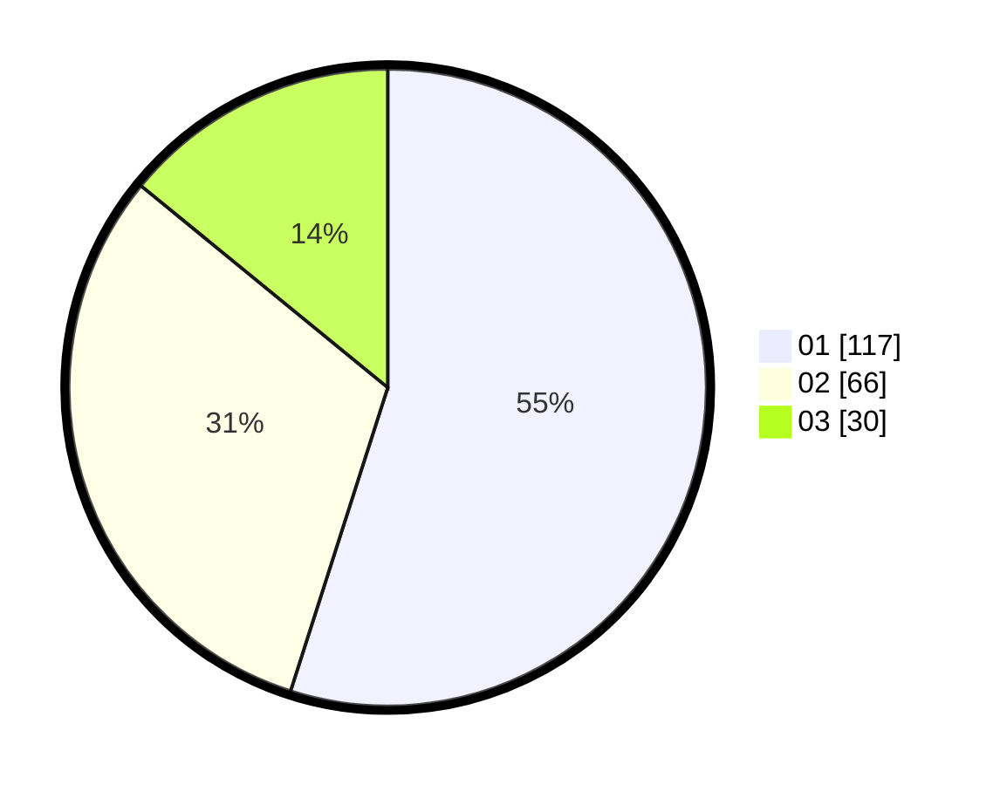

# Hasil

Hasil perolehan suara paslon dapat dilihat pada file paslon-01.txt, paslon-02.txt, dan paslon-03.txt.

Jika tidak ada, artinya data tersebut belum ada pada SIREKAP.

## Perolehan Suara

 * Paslon 01: **117**.
 * Paslon 02: **66**.
 * Paslon 03: **30**.

## Foto C Plano

https://sirekap-obj-formc.kpu.go.id/a489/pemilu/ppwp/31/75/02/10/02/3175021002110-20240215-001805--ffb6e1b6-145e-4bd3-97bc-53aa8299b94f.jpg

https://sirekap-obj-formc.kpu.go.id/a489/pemilu/ppwp/31/75/02/10/02/3175021002110-20240215-001903--b6fa4c90-3c8e-4f75-8365-c4ceb0866bdb.jpg

https://sirekap-obj-formc.kpu.go.id/a489/pemilu/ppwp/31/75/02/10/02/3175021002110-20240215-001944--f11cb279-5159-4fe1-9d7a-5492f382f3ef.jpg

## DATA PEMILIH TETAP

Jumlah pemilih dalam DPT: **257**.
 * L: **124**.
 * P: **133**.

## DATA PENGGUNA HAK PILIH

Jumlah pengguna hak pilih dalam DPT: **215**.
 * L: **102**.
 * P: **113**.

Jumlah pengguna hak pilih dalam DPTb: **1**.
 * L: **0**.
 * P: **1**.

Jumlah pengguna hak pilih dalam DPK: **0**.
 * L: **0**.
 * P: **0**.

Jumlah pengguna hak pilih: **216**.
 * L: **102**.
 * P: **114**.

## JUMLAH SUARA SAH DAN TIDAK SAH

JUMLAH SELURUH SUARA SAH: **213**.

JUMLAH SUARA TIDAK SAH: **3**.

JUMLAH SELURUH SUARA SAH DAN SUARA TIDAK SAH: **216**.
