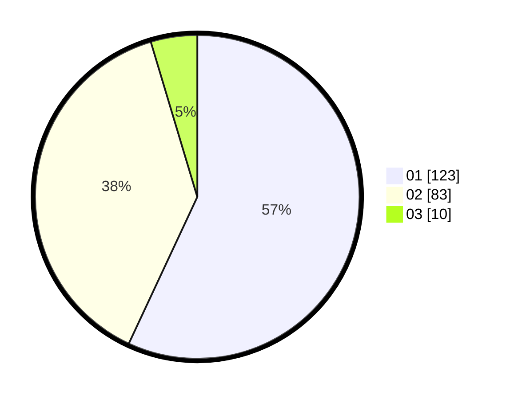

# Hasil

Hasil perolehan suara paslon dapat dilihat pada file paslon-01.txt, paslon-02.txt, dan paslon-03.txt.

Jika tidak ada, artinya data tersebut belum ada pada SIREKAP.

## Perolehan Suara

 * Paslon 01: **123**.
 * Paslon 02: **83**.
 * Paslon 03: **10**.

## Foto C Plano

https://sirekap-obj-formc.kpu.go.id/6db4/pemilu/ppwp/31/75/02/10/02/3175021002111-20240214-212841--2e6af8b0-90ea-4917-a739-872327ae94a5.jpg

https://sirekap-obj-formc.kpu.go.id/6db4/pemilu/ppwp/31/75/02/10/02/3175021002111-20240214-202542--28aac399-464d-4477-953a-f419d30ec0fb.jpg

https://sirekap-obj-formc.kpu.go.id/6db4/pemilu/ppwp/31/75/02/10/02/3175021002111-20240214-203019--65c5c0f6-3b4d-46b4-9669-2c24c9a0155c.jpg
