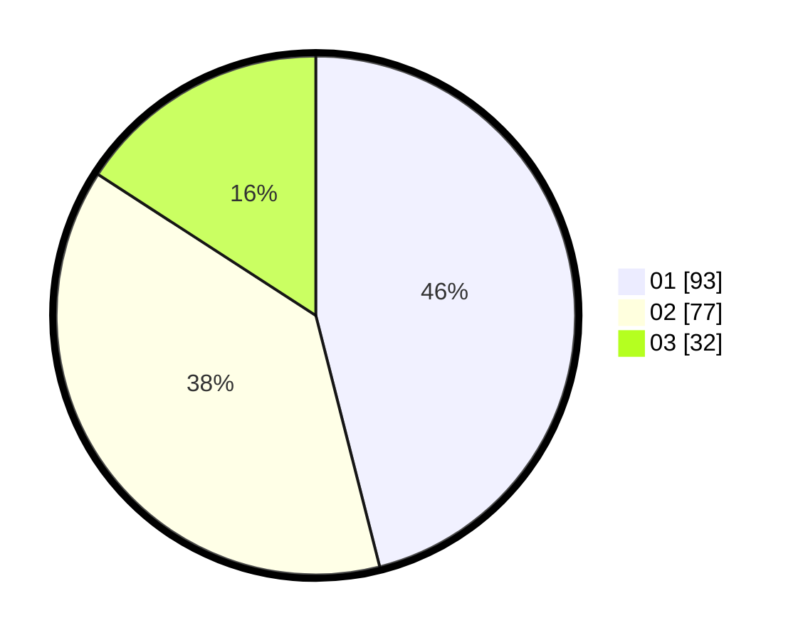

# Hasil

Hasil perolehan suara paslon dapat dilihat pada file paslon-01.txt, paslon-02.txt, dan paslon-03.txt.

Jika tidak ada, artinya data tersebut belum ada pada SIREKAP.

## Perolehan Suara

 * Paslon 01: **93**.
 * Paslon 02: **77**.
 * Paslon 03: **32**.

## Foto C Plano

https://sirekap-obj-formc.kpu.go.id/cf2e/pemilu/ppwp/31/75/02/10/02/3175021002114-20240216-140558--1e7645ac-790b-4c22-a703-616e3d78fdbc.jpg

https://sirekap-obj-formc.kpu.go.id/cf2e/pemilu/ppwp/31/75/02/10/02/3175021002114-20240216-140559--6700816e-88c6-4ab8-9ed5-c85b4b8e3fe4.jpg

https://sirekap-obj-formc.kpu.go.id/cf2e/pemilu/ppwp/31/75/02/10/02/3175021002114-20240216-140558--af52ae47-de3f-47de-9007-eec4168d7f7a.jpg

## DATA PEMILIH TETAP

Jumlah pemilih dalam DPT: **259**.
 * L: **116**.
 * P: **143**.

## DATA PENGGUNA HAK PILIH

Jumlah pengguna hak pilih dalam DPT: **201**.
 * L: **87**.
 * P: **114**.

Jumlah pengguna hak pilih dalam DPTb: **0**.
 * L: **0**.
 * P: **0**.

Jumlah pengguna hak pilih dalam DPK: **5**.
 * L: **2**.
 * P: **3**.

Jumlah pengguna hak pilih: **206**.
 * L: **89**.
 * P: **117**.

## JUMLAH SUARA SAH DAN TIDAK SAH

JUMLAH SELURUH SUARA SAH: **202**.

JUMLAH SUARA TIDAK SAH: **4**.

JUMLAH SELURUH SUARA SAH DAN SUARA TIDAK SAH: **206**.
