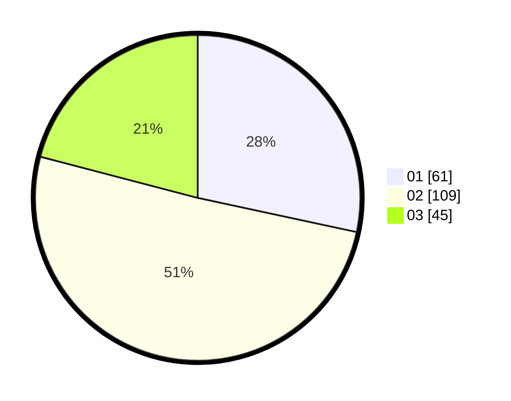

# Hasil

Hasil perolehan suara paslon dapat dilihat pada file paslon-01.txt, paslon-02.txt, dan paslon-03.txt.

Jika tidak ada, artinya data tersebut belum ada pada SIREKAP.

## Perolehan Suara

 * Paslon 01: **61**.
 * Paslon 02: **109**.
 * Paslon 03: **45**.

## Foto C Plano

https://sirekap-obj-formc.kpu.go.id/9dd0/pemilu/ppwp/31/75/02/10/02/3175021002116-20240215-030402--8c7ab861-d964-4f87-b103-ed2ad443c321.jpg

https://sirekap-obj-formc.kpu.go.id/9dd0/pemilu/ppwp/31/75/02/10/02/3175021002116-20240215-030536--a4b09f68-fd4f-4b15-a5b5-078ec9a490b8.jpg

https://sirekap-obj-formc.kpu.go.id/9dd0/pemilu/ppwp/31/75/02/10/02/3175021002116-20240215-030653--d0558296-833d-4402-bba1-a7da80131507.jpg

## DATA PEMILIH TETAP

Jumlah pemilih dalam DPT: **271**.
 * L: **130**.
 * P: **141**.

## DATA PENGGUNA HAK PILIH

Jumlah pengguna hak pilih dalam DPT: **211**.
 * L: **113**.
 * P: **98**.

Jumlah pengguna hak pilih dalam DPTb: **4**.
 * L: **2**.
 * P: **2**.

Jumlah pengguna hak pilih dalam DPK: **2**.
 * L: **1**.
 * P: **1**.

Jumlah pengguna hak pilih: **217**.
 * L: **116**.
 * P: **101**.

## JUMLAH SUARA SAH DAN TIDAK SAH

JUMLAH SELURUH SUARA SAH: **215**.

JUMLAH SUARA TIDAK SAH: **2**.

JUMLAH SELURUH SUARA SAH DAN SUARA TIDAK SAH: **217**.
