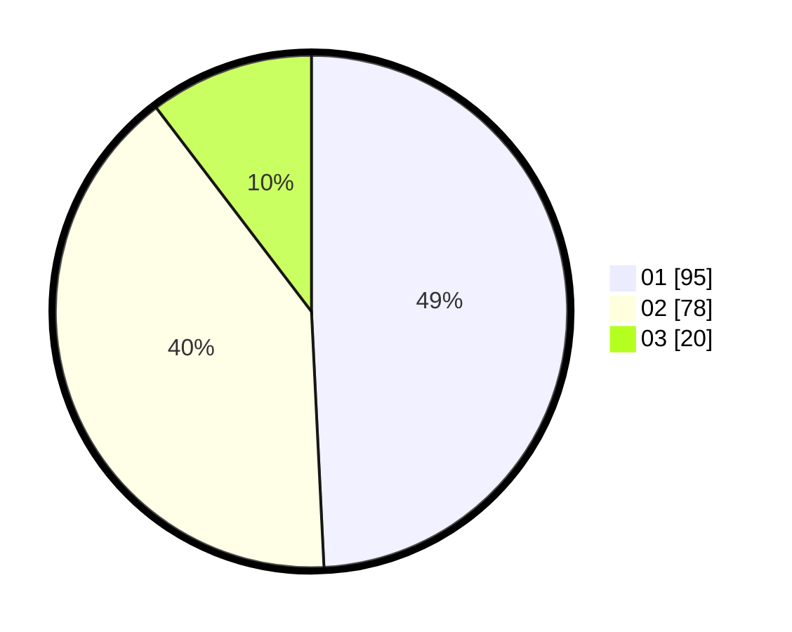

# Hasil

Hasil perolehan suara paslon dapat dilihat pada file paslon-01.txt, paslon-02.txt, dan paslon-03.txt.

Jika tidak ada, artinya data tersebut belum ada pada SIREKAP.

## Perolehan Suara

 * Paslon 01: **95**.
 * Paslon 02: **78**.
 * Paslon 03: **20**.

## Foto C Plano

https://sirekap-obj-formc.kpu.go.id/6686/pemilu/ppwp/31/75/02/10/02/3175021002119-20240217-234729--5a7a13cf-4d11-49ac-86ba-1b6440b4114b.jpg

https://sirekap-obj-formc.kpu.go.id/6686/pemilu/ppwp/31/75/02/10/02/3175021002119-20240217-234730--9c6dde13-c6ba-45a5-9780-aa67cd6d2e8a.jpg

https://sirekap-obj-formc.kpu.go.id/6686/pemilu/ppwp/31/75/02/10/02/3175021002119-20240217-234729--80097f24-128d-4f14-8040-221dbf5be220.jpg

## DATA PEMILIH TETAP

Jumlah pemilih dalam DPT: **0**.
 * L: **0**.
 * P: **0**.

## DATA PENGGUNA HAK PILIH

Jumlah pengguna hak pilih dalam DPT: **0**.
 * L: **0**.
 * P: **0**.

Jumlah pengguna hak pilih dalam DPTb: **0**.
 * L: **0**.
 * P: **0**.

Jumlah pengguna hak pilih dalam DPK: **0**.
 * L: **0**.
 * P: **0**.

Jumlah pengguna hak pilih: **0**.
 * L: **0**.
 * P: **0**.

## JUMLAH SUARA SAH DAN TIDAK SAH

JUMLAH SELURUH SUARA SAH: **193**.

JUMLAH SUARA TIDAK SAH: **2**.

JUMLAH SELURUH SUARA SAH DAN SUARA TIDAK SAH: **195**.
