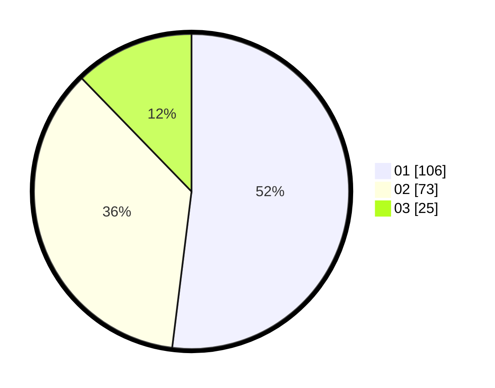

# Hasil

Hasil perolehan suara paslon dapat dilihat pada file paslon-01.txt, paslon-02.txt, dan paslon-03.txt.

Jika tidak ada, artinya data tersebut belum ada pada SIREKAP.

## Perolehan Suara

 * Paslon 01: **106**.
 * Paslon 02: **73**.
 * Paslon 03: **25**.

## Foto C Plano

https://sirekap-obj-formc.kpu.go.id/414a/pemilu/ppwp/31/75/02/10/02/3175021002120-20240216-142957--945ec12e-2178-4944-850b-f226a8fb04f6.jpg

https://sirekap-obj-formc.kpu.go.id/414a/pemilu/ppwp/31/75/02/10/02/3175021002120-20240216-150259--c8a448c0-8d34-48dd-8d5e-1337b0c80667.jpg

https://sirekap-obj-formc.kpu.go.id/414a/pemilu/ppwp/31/75/02/10/02/3175021002120-20240216-144351--74f54d84-611e-4119-9702-03b03e5425ac.jpg

## DATA PEMILIH TETAP

Jumlah pemilih dalam DPT: **259**.
 * L: **126**.
 * P: **133**.

## DATA PENGGUNA HAK PILIH

Jumlah pengguna hak pilih dalam DPT: **206**.
 * L: **99**.
 * P: **107**.

Jumlah pengguna hak pilih dalam DPTb: **0**.
 * L: **0**.
 * P: **0**.

Jumlah pengguna hak pilih dalam DPK: **2**.
 * L: **1**.
 * P: **1**.

Jumlah pengguna hak pilih: **208**.
 * L: **100**.
 * P: **108**.

## JUMLAH SUARA SAH DAN TIDAK SAH

JUMLAH SELURUH SUARA SAH: **204**.

JUMLAH SUARA TIDAK SAH: **4**.

JUMLAH SELURUH SUARA SAH DAN SUARA TIDAK SAH: **208**.
