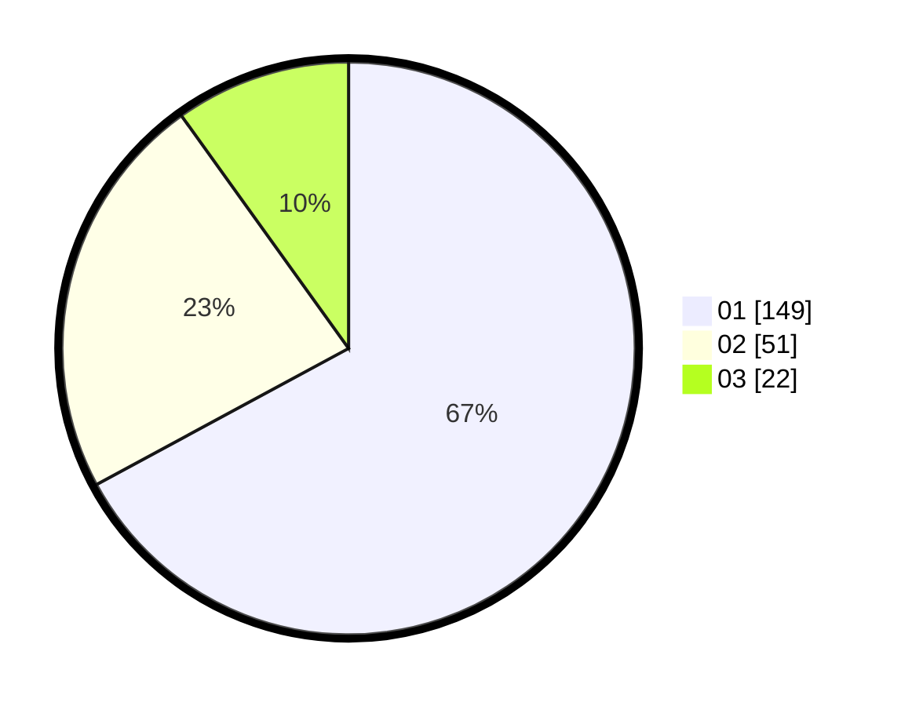

# Hasil

Hasil perolehan suara paslon dapat dilihat pada file paslon-01.txt, paslon-02.txt, dan paslon-03.txt.

Jika tidak ada, artinya data tersebut belum ada pada SIREKAP.

## Perolehan Suara

 * Paslon 01: **149**.
 * Paslon 02: **51**.
 * Paslon 03: **22**.

## Foto C Plano

https://sirekap-obj-formc.kpu.go.id/70e9/pemilu/ppwp/31/75/02/10/02/3175021002125-20240214-230339--523018d1-7493-442a-ba5d-6e9594b7a463.jpg

https://sirekap-obj-formc.kpu.go.id/70e9/pemilu/ppwp/31/75/02/10/02/3175021002125-20240214-230439--e1bcef2e-e7ff-470f-8f62-9df97316e608.jpg

https://sirekap-obj-formc.kpu.go.id/70e9/pemilu/ppwp/31/75/02/10/02/3175021002125-20240214-230532--4e9cc350-e7a7-45ee-a5f1-fd7d765a2ac2.jpg
