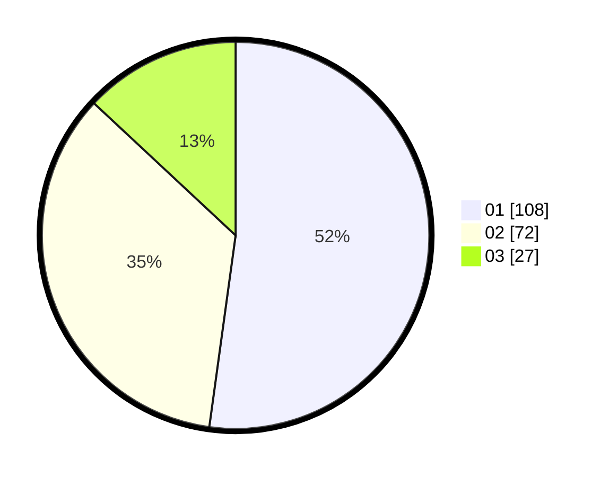

# Hasil

Hasil perolehan suara paslon dapat dilihat pada file paslon-01.txt, paslon-02.txt, dan paslon-03.txt.

Jika tidak ada, artinya data tersebut belum ada pada SIREKAP.

## Perolehan Suara

 * Paslon 01: **108**.
 * Paslon 02: **72**.
 * Paslon 03: **27**.

## Foto C Plano

https://sirekap-obj-formc.kpu.go.id/e9d9/pemilu/ppwp/31/75/02/10/02/3175021002127-20240216-173157--3816961a-5eba-44d6-951b-fa30aff8a6dd.jpg

https://sirekap-obj-formc.kpu.go.id/e9d9/pemilu/ppwp/31/75/02/10/02/3175021002127-20240216-173158--a1d2a709-675a-44b3-a87b-d5dc56728036.jpg

https://sirekap-obj-formc.kpu.go.id/e9d9/pemilu/ppwp/31/75/02/10/02/3175021002127-20240216-173158--cd238af9-28ea-4a95-bd27-eecd3ed92954.jpg

## DATA PEMILIH TETAP

Jumlah pemilih dalam DPT: **260**.
 * L: **136**.
 * P: **124**.

## DATA PENGGUNA HAK PILIH

Jumlah pengguna hak pilih dalam DPT: **205**.
 * L: **104**.
 * P: **101**.

Jumlah pengguna hak pilih dalam DPTb: **2**.
 * L: **2**.
 * P: **0**.

Jumlah pengguna hak pilih dalam DPK: **0**.
 * L: **0**.
 * P: **0**.

Jumlah pengguna hak pilih: **207**.
 * L: **106**.
 * P: **101**.

## JUMLAH SUARA SAH DAN TIDAK SAH

JUMLAH SELURUH SUARA SAH: **207**.

JUMLAH SUARA TIDAK SAH: **0**.

JUMLAH SELURUH SUARA SAH DAN SUARA TIDAK SAH: **207**.
