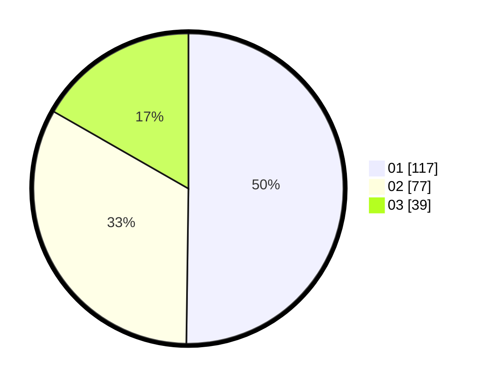

# Hasil

Hasil perolehan suara paslon dapat dilihat pada file paslon-01.txt, paslon-02.txt, dan paslon-03.txt.

Jika tidak ada, artinya data tersebut belum ada pada SIREKAP.

## Perolehan Suara

 * Paslon 01: **117**.
 * Paslon 02: **77**.
 * Paslon 03: **39**.

## Foto C Plano

https://sirekap-obj-formc.kpu.go.id/29e1/pemilu/ppwp/31/75/02/10/02/3175021002130-20240214-155209--d3d4aa4e-bcc0-4cc8-bb1c-1ac64e90dc3e.jpg

https://sirekap-obj-formc.kpu.go.id/29e1/pemilu/ppwp/31/75/02/10/02/3175021002130-20240214-155044--9a280ecb-bcad-4ba8-bf46-ecb0b625e760.jpg

https://sirekap-obj-formc.kpu.go.id/29e1/pemilu/ppwp/31/75/02/10/02/3175021002130-20240214-155122--159c35cc-07af-4c1c-8e82-43964c3aeb2f.jpg

## DATA PEMILIH TETAP

Jumlah pemilih dalam DPT: **507**.
 * L: **0**.
 * P: **557**.

## DATA PENGGUNA HAK PILIH

Jumlah pengguna hak pilih dalam DPT: **1**.
 * L: **7**.
 * P: **5**.

Jumlah pengguna hak pilih dalam DPTb: **574**.
 * L: **774**.
 * P: **555**.

Jumlah pengguna hak pilih dalam DPK: **10**.
 * L: **757**.
 * P: **556**.

Jumlah pengguna hak pilih: **781**.
 * L: **777**.
 * P: **275**.

## JUMLAH SUARA SAH DAN TIDAK SAH

JUMLAH SELURUH SUARA SAH: **233**.

JUMLAH SUARA TIDAK SAH: **5**.

JUMLAH SELURUH SUARA SAH DAN SUARA TIDAK SAH: **238**.
