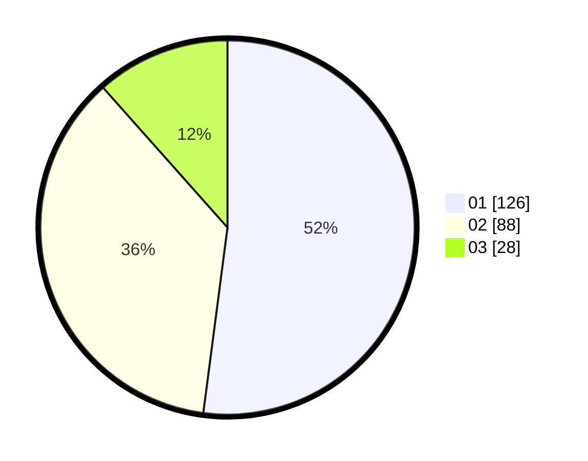

# Hasil

Hasil perolehan suara paslon dapat dilihat pada file paslon-01.txt, paslon-02.txt, dan paslon-03.txt.

Jika tidak ada, artinya data tersebut belum ada pada SIREKAP.

## Perolehan Suara

 * Paslon 01: **126**.
 * Paslon 02: **88**.
 * Paslon 03: **28**.

## Foto C Plano

https://sirekap-obj-formc.kpu.go.id/1fdd/pemilu/ppwp/31/75/02/10/02/3175021002131-20240214-175327--f9b35630-8d96-4928-a871-8891527c0aa4.jpg

https://sirekap-obj-formc.kpu.go.id/1fdd/pemilu/ppwp/31/75/02/10/02/3175021002131-20240214-175444--b32aa08f-0897-48a6-a700-4d9e2d5a071e.jpg

https://sirekap-obj-formc.kpu.go.id/1fdd/pemilu/ppwp/31/75/02/10/02/3175021002131-20240214-193800--41c9f2d9-41d2-40ca-8515-edfbb31f5c95.jpg

## DATA PEMILIH TETAP

Jumlah pemilih dalam DPT: **286**.
 * L: **141**.
 * P: **145**.

## DATA PENGGUNA HAK PILIH

Jumlah pengguna hak pilih dalam DPT: **230**.
 * L: **113**.
 * P: **117**.

Jumlah pengguna hak pilih dalam DPTb: **13**.
 * L: **3**.
 * P: **10**.

Jumlah pengguna hak pilih dalam DPK: **3**.
 * L: **2**.
 * P: **1**.

Jumlah pengguna hak pilih: **246**.
 * L: **118**.
 * P: **128**.

## JUMLAH SUARA SAH DAN TIDAK SAH

JUMLAH SELURUH SUARA SAH: **242**.

JUMLAH SUARA TIDAK SAH: **4**.

JUMLAH SELURUH SUARA SAH DAN SUARA TIDAK SAH: **246**.
