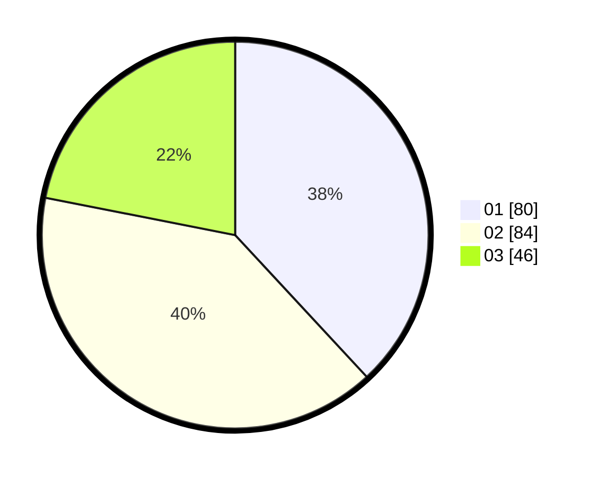

# Hasil

Hasil perolehan suara paslon dapat dilihat pada file paslon-01.txt, paslon-02.txt, dan paslon-03.txt.

Jika tidak ada, artinya data tersebut belum ada pada SIREKAP.

## Perolehan Suara

 * Paslon 01: **80**.
 * Paslon 02: **84**.
 * Paslon 03: **46**.

## Foto C Plano

https://sirekap-obj-formc.kpu.go.id/6b21/pemilu/ppwp/31/75/02/10/02/3175021002134-20240215-205415--10d926a5-b2ee-4aa1-8f00-ca014501e9f9.jpg

https://sirekap-obj-formc.kpu.go.id/6b21/pemilu/ppwp/31/75/02/10/02/3175021002134-20240215-205417--c3fadc96-8412-4912-b774-90ea2d3be729.jpg

https://sirekap-obj-formc.kpu.go.id/6b21/pemilu/ppwp/31/75/02/10/02/3175021002134-20240215-205416--5b5d70ab-c182-4afb-9860-dc63013a02ac.jpg

## DATA PEMILIH TETAP

Jumlah pemilih dalam DPT: **0**.
 * L: **0**.
 * P: **0**.

## DATA PENGGUNA HAK PILIH

Jumlah pengguna hak pilih dalam DPT: **0**.
 * L: **0**.
 * P: **0**.

Jumlah pengguna hak pilih dalam DPTb: **0**.
 * L: **0**.
 * P: **0**.

Jumlah pengguna hak pilih dalam DPK: **0**.
 * L: **0**.
 * P: **0**.

Jumlah pengguna hak pilih: **0**.
 * L: **0**.
 * P: **0**.

## JUMLAH SUARA SAH DAN TIDAK SAH

JUMLAH SELURUH SUARA SAH: **210**.

JUMLAH SUARA TIDAK SAH: **2**.

JUMLAH SELURUH SUARA SAH DAN SUARA TIDAK SAH: **212**.
