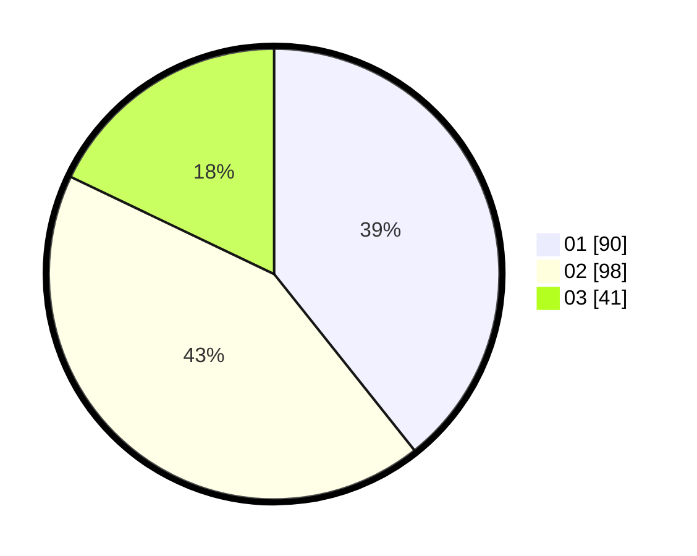

# Hasil

Hasil perolehan suara paslon dapat dilihat pada file paslon-01.txt, paslon-02.txt, dan paslon-03.txt.

Jika tidak ada, artinya data tersebut belum ada pada SIREKAP.

## Perolehan Suara

 * Paslon 01: **90**.
 * Paslon 02: **98**.
 * Paslon 03: **41**.

## Foto C Plano

https://sirekap-obj-formc.kpu.go.id/bfa8/pemilu/ppwp/31/75/02/10/02/3175021002135-20240216-025914--4a98e156-2611-495c-94b0-ed0e7d90684c.jpg

https://sirekap-obj-formc.kpu.go.id/bfa8/pemilu/ppwp/31/75/02/10/02/3175021002135-20240216-083748--9e072aaf-5521-44c1-87fa-78509f27c3fa.jpg

https://sirekap-obj-formc.kpu.go.id/bfa8/pemilu/ppwp/31/75/02/10/02/3175021002135-20240216-083747--72e82ec9-f396-4aa6-b665-d7b6858e480a.jpg

## DATA PEMILIH TETAP

Jumlah pemilih dalam DPT: **285**.
 * L: **137**.
 * P: **148**.

## DATA PENGGUNA HAK PILIH

Jumlah pengguna hak pilih dalam DPT: **285**.
 * L: **137**.
 * P: **148**.

Jumlah pengguna hak pilih dalam DPTb: **2**.
 * L: **1**.
 * P: **1**.

Jumlah pengguna hak pilih dalam DPK: **0**.
 * L: **0**.
 * P: **0**.

Jumlah pengguna hak pilih: **287**.
 * L: **138**.
 * P: **149**.

## JUMLAH SUARA SAH DAN TIDAK SAH

JUMLAH SELURUH SUARA SAH: **229**.

JUMLAH SUARA TIDAK SAH: **4**.

JUMLAH SELURUH SUARA SAH DAN SUARA TIDAK SAH: **233**.
