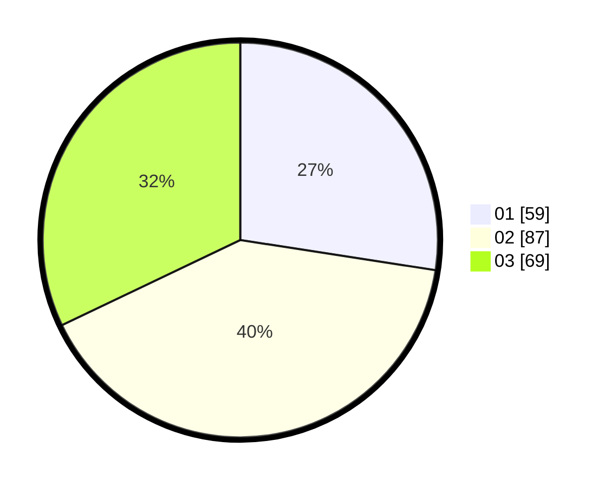

# Hasil

Hasil perolehan suara paslon dapat dilihat pada file paslon-01.txt, paslon-02.txt, dan paslon-03.txt.

Jika tidak ada, artinya data tersebut belum ada pada SIREKAP.

## Perolehan Suara

 * Paslon 01: **59**.
 * Paslon 02: **87**.
 * Paslon 03: **69**.

## Foto C Plano

https://sirekap-obj-formc.kpu.go.id/04ee/pemilu/ppwp/31/75/02/10/03/3175021003004-20240215-022223--7b645e1b-d8a2-4ecf-8a15-796f9aad3154.jpg

https://sirekap-obj-formc.kpu.go.id/04ee/pemilu/ppwp/31/75/02/10/03/3175021003004-20240214-155344--d151d15e-0ab6-47d0-bd3e-f77fdf670344.jpg

https://sirekap-obj-formc.kpu.go.id/04ee/pemilu/ppwp/31/75/02/10/03/3175021003004-20240214-160106--6b18be65-fabd-4ddc-a24a-19b11f9dd372.jpg

## DATA PEMILIH TETAP

Jumlah pemilih dalam DPT: **290**.
 * L: **138**.
 * P: **152**.

## DATA PENGGUNA HAK PILIH

Jumlah pengguna hak pilih dalam DPT: **213**.
 * L: **95**.
 * P: **118**.

Jumlah pengguna hak pilih dalam DPTb: **3**.
 * L: **1**.
 * P: **2**.

Jumlah pengguna hak pilih dalam DPK: **3**.
 * L: **1**.
 * P: **2**.

Jumlah pengguna hak pilih: **219**.
 * L: **97**.
 * P: **122**.

## JUMLAH SUARA SAH DAN TIDAK SAH

JUMLAH SELURUH SUARA SAH: **215**.

JUMLAH SUARA TIDAK SAH: **4**.

JUMLAH SELURUH SUARA SAH DAN SUARA TIDAK SAH: **219**.
