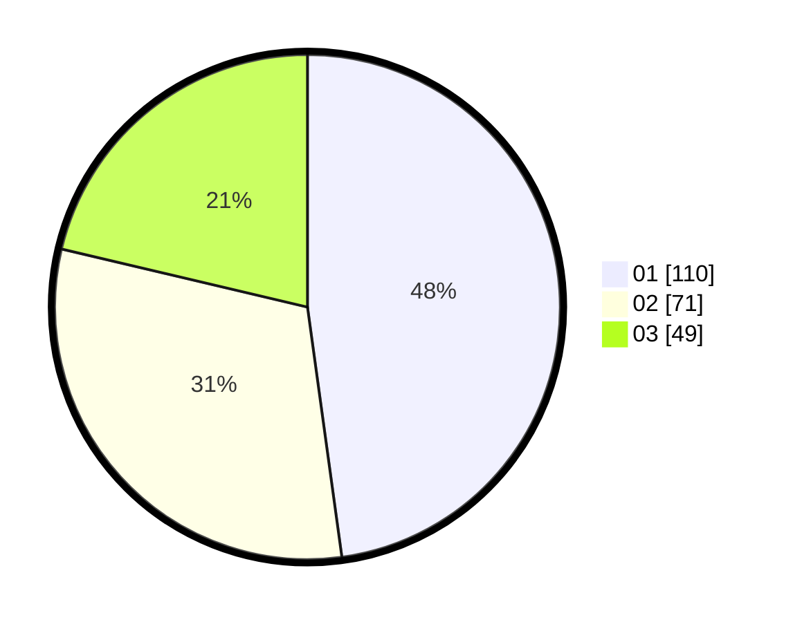

# Hasil

Hasil perolehan suara paslon dapat dilihat pada file paslon-01.txt, paslon-02.txt, dan paslon-03.txt.

Jika tidak ada, artinya data tersebut belum ada pada SIREKAP.

## Perolehan Suara

 * Paslon 01: **110**.
 * Paslon 02: **71**.
 * Paslon 03: **49**.

## Foto C Plano

https://sirekap-obj-formc.kpu.go.id/e63a/pemilu/ppwp/31/75/02/10/03/3175021003005-20240214-184819--9ede1013-99c9-4630-95a1-d08af59a85ae.jpg

https://sirekap-obj-formc.kpu.go.id/e63a/pemilu/ppwp/31/75/02/10/03/3175021003005-20240214-184954--639fa9cb-5b0e-4baa-8c0a-8fadef0d35bd.jpg

https://sirekap-obj-formc.kpu.go.id/e63a/pemilu/ppwp/31/75/02/10/03/3175021003005-20240214-155526--efcabe99-d227-448c-9a4d-625322b18143.jpg

## DATA PEMILIH TETAP

Jumlah pemilih dalam DPT: **288**.
 * L: **138**.
 * P: **150**.

## DATA PENGGUNA HAK PILIH

Jumlah pengguna hak pilih dalam DPT: **230**.
 * L: **109**.
 * P: **121**.

Jumlah pengguna hak pilih dalam DPTb: **6**.
 * L: **2**.
 * P: **4**.

Jumlah pengguna hak pilih dalam DPK: **0**.
 * L: **0**.
 * P: **0**.

Jumlah pengguna hak pilih: **236**.
 * L: **111**.
 * P: **125**.

## JUMLAH SUARA SAH DAN TIDAK SAH

JUMLAH SELURUH SUARA SAH: **230**.

JUMLAH SUARA TIDAK SAH: **6**.

JUMLAH SELURUH SUARA SAH DAN SUARA TIDAK SAH: **236**.
