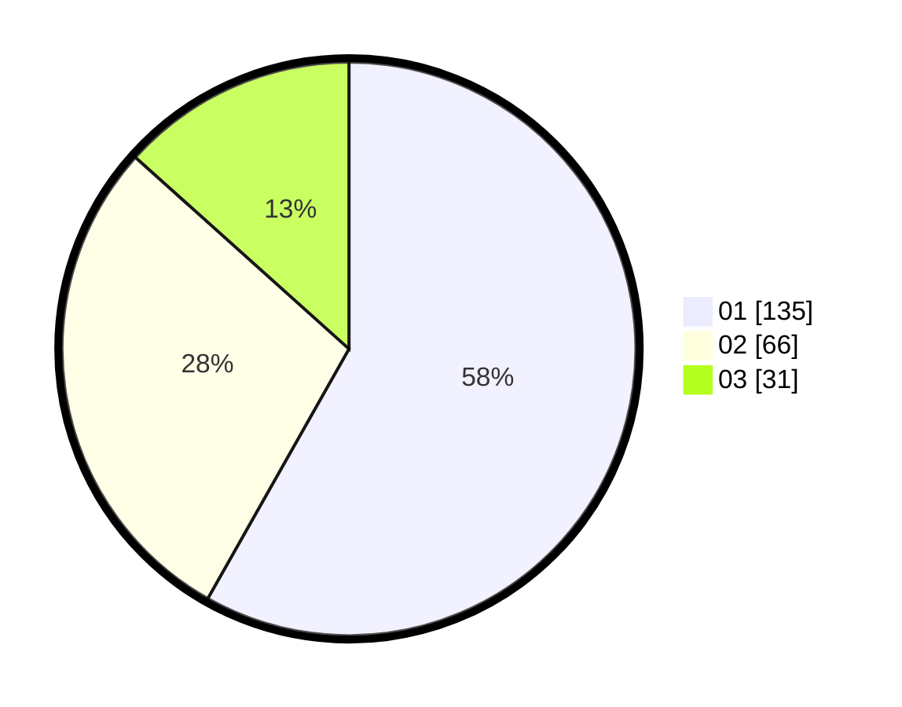

# Hasil

Hasil perolehan suara paslon dapat dilihat pada file paslon-01.txt, paslon-02.txt, dan paslon-03.txt.

Jika tidak ada, artinya data tersebut belum ada pada SIREKAP.

## Perolehan Suara

 * Paslon 01: **135**.
 * Paslon 02: **66**.
 * Paslon 03: **31**.

## Foto C Plano

https://sirekap-obj-formc.kpu.go.id/2c67/pemilu/ppwp/31/75/02/10/03/3175021003008-20240214-225412--61bdf22b-e1be-4a96-b359-f8094113a942.jpg

https://sirekap-obj-formc.kpu.go.id/2c67/pemilu/ppwp/31/75/02/10/03/3175021003008-20240214-225515--26edd14b-b19b-454e-8883-f6154a095e03.jpg

https://sirekap-obj-formc.kpu.go.id/2c67/pemilu/ppwp/31/75/02/10/03/3175021003008-20240214-225611--c92199f8-1c2b-4759-87b6-b628b0f5e696.jpg
