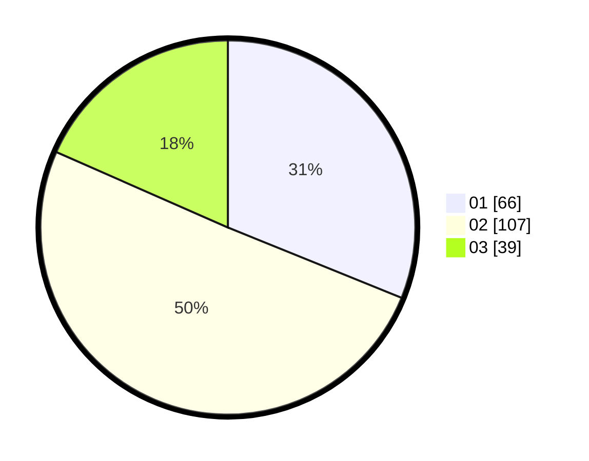

# Hasil

Hasil perolehan suara paslon dapat dilihat pada file paslon-01.txt, paslon-02.txt, dan paslon-03.txt.

Jika tidak ada, artinya data tersebut belum ada pada SIREKAP.

## Perolehan Suara

 * Paslon 01: **66**.
 * Paslon 02: **107**.
 * Paslon 03: **39**.

## Foto C Plano

https://sirekap-obj-formc.kpu.go.id/bcf9/pemilu/ppwp/31/75/02/10/03/3175021003009-20240214-155044--ef8631cc-b035-46c6-b7b6-fdbbc91e45f7.jpg

https://sirekap-obj-formc.kpu.go.id/bcf9/pemilu/ppwp/31/75/02/10/03/3175021003009-20240214-155109--c0053167-f7af-490c-9517-cb6d13de872f.jpg

https://sirekap-obj-formc.kpu.go.id/bcf9/pemilu/ppwp/31/75/02/10/03/3175021003009-20240214-155121--9cb45847-6096-4cbf-bd8d-4f71432b60e1.jpg

## DATA PEMILIH TETAP

Jumlah pemilih dalam DPT: **269**.
 * L: **128**.
 * P: **141**.

## DATA PENGGUNA HAK PILIH

Jumlah pengguna hak pilih dalam DPT: **208**.
 * L: **95**.
 * P: **113**.

Jumlah pengguna hak pilih dalam DPTb: **3**.
 * L: **1**.
 * P: **2**.

Jumlah pengguna hak pilih dalam DPK: **7**.
 * L: **5**.
 * P: **2**.

Jumlah pengguna hak pilih: **218**.
 * L: **101**.
 * P: **117**.

## JUMLAH SUARA SAH DAN TIDAK SAH

JUMLAH SELURUH SUARA SAH: **212**.

JUMLAH SUARA TIDAK SAH: **6**.

JUMLAH SELURUH SUARA SAH DAN SUARA TIDAK SAH: **218**.
