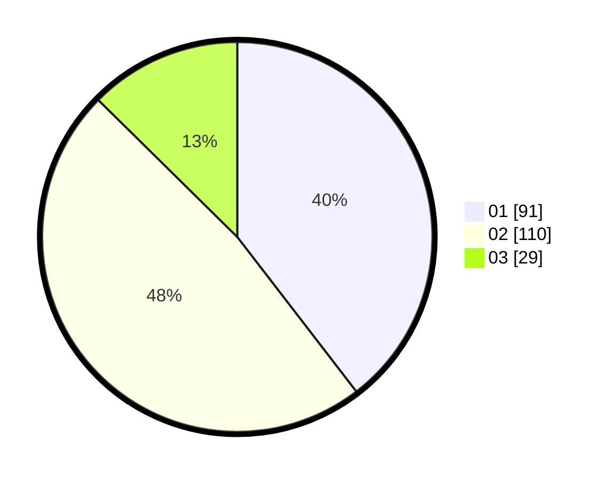

# Hasil

Hasil perolehan suara paslon dapat dilihat pada file paslon-01.txt, paslon-02.txt, dan paslon-03.txt.

Jika tidak ada, artinya data tersebut belum ada pada SIREKAP.

## Perolehan Suara

 * Paslon 01: **91**.
 * Paslon 02: **110**.
 * Paslon 03: **29**.

## Foto C Plano

https://sirekap-obj-formc.kpu.go.id/e949/pemilu/ppwp/31/75/02/10/03/3175021003010-20240216-143354--33eb47a3-12d5-4ef9-bc8a-6ef99918ebce.jpg

https://sirekap-obj-formc.kpu.go.id/e949/pemilu/ppwp/31/75/02/10/03/3175021003010-20240216-091957--f22d17f2-a725-42f6-8344-5ac67d6bd290.jpg

https://sirekap-obj-formc.kpu.go.id/e949/pemilu/ppwp/31/75/02/10/03/3175021003010-20240216-093501--3b9654b4-ce58-40e0-916f-8942ff5f1bae.jpg

## DATA PEMILIH TETAP

Jumlah pemilih dalam DPT: **266**.
 * L: **126**.
 * P: **140**.

## DATA PENGGUNA HAK PILIH

Jumlah pengguna hak pilih dalam DPT: **232**.
 * L: **109**.
 * P: **123**.

Jumlah pengguna hak pilih dalam DPTb: **2**.
 * L: **1**.
 * P: **1**.

Jumlah pengguna hak pilih dalam DPK: **0**.
 * L: **0**.
 * P: **0**.

Jumlah pengguna hak pilih: **234**.
 * L: **110**.
 * P: **124**.

## JUMLAH SUARA SAH DAN TIDAK SAH

JUMLAH SELURUH SUARA SAH: **230**.

JUMLAH SUARA TIDAK SAH: **4**.

JUMLAH SELURUH SUARA SAH DAN SUARA TIDAK SAH: **234**.
