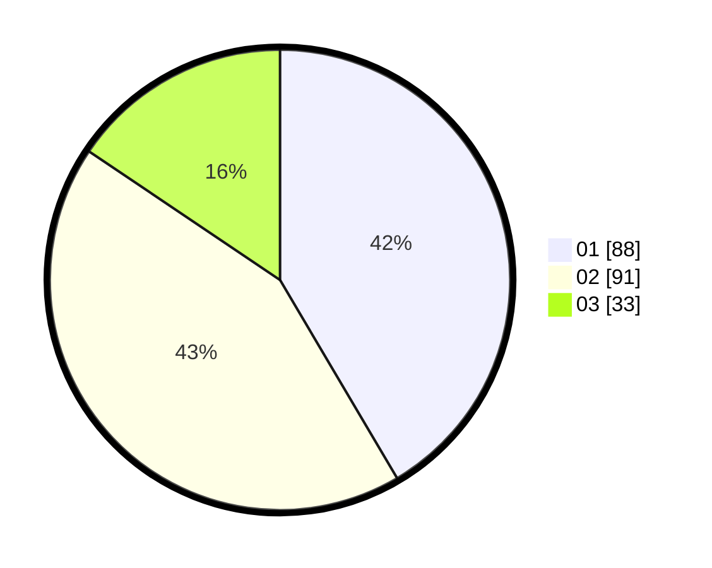

# Hasil

Hasil perolehan suara paslon dapat dilihat pada file paslon-01.txt, paslon-02.txt, dan paslon-03.txt.

Jika tidak ada, artinya data tersebut belum ada pada SIREKAP.

## Perolehan Suara

 * Paslon 01: **88**.
 * Paslon 02: **91**.
 * Paslon 03: **33**.

## Foto C Plano

https://sirekap-obj-formc.kpu.go.id/d694/pemilu/ppwp/31/75/02/10/03/3175021003012-20240214-191840--4e4986da-1919-47e5-bcda-0246ad7ec841.jpg

https://sirekap-obj-formc.kpu.go.id/d694/pemilu/ppwp/31/75/02/10/03/3175021003012-20240214-160110--dbe4ef03-bcad-4e66-a28e-4fc09f049eb6.jpg
