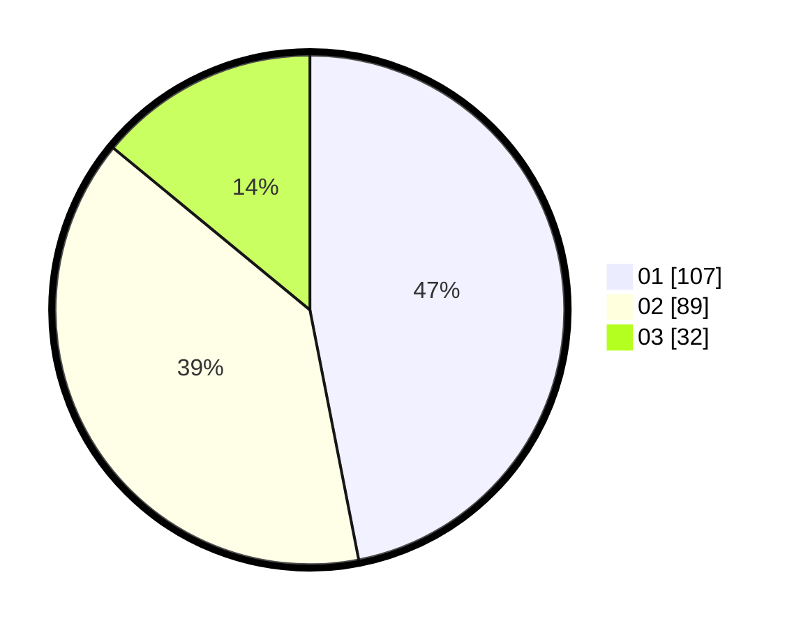

# Hasil

Hasil perolehan suara paslon dapat dilihat pada file paslon-01.txt, paslon-02.txt, dan paslon-03.txt.

Jika tidak ada, artinya data tersebut belum ada pada SIREKAP.

## Perolehan Suara

 * Paslon 01: **107**.
 * Paslon 02: **89**.
 * Paslon 03: **32**.

## Foto C Plano

https://sirekap-obj-formc.kpu.go.id/fb54/pemilu/ppwp/31/75/02/10/03/3175021003014-20240214-203451--afdcf6f0-a78f-42aa-a843-6ef74fe5e8b1.jpg

https://sirekap-obj-formc.kpu.go.id/fb54/pemilu/ppwp/31/75/02/10/03/3175021003014-20240214-203553--c7e3dcb7-5529-4d7b-a277-51e893c4d64d.jpg

https://sirekap-obj-formc.kpu.go.id/fb54/pemilu/ppwp/31/75/02/10/03/3175021003014-20240214-203328--dba8b5ff-f496-4dbc-9e87-7550694b6a29.jpg

## DATA PEMILIH TETAP

Jumlah pemilih dalam DPT: **262**.
 * L: **123**.
 * P: **139**.

## DATA PENGGUNA HAK PILIH

Jumlah pengguna hak pilih dalam DPT: **228**.
 * L: **105**.
 * P: **123**.

Jumlah pengguna hak pilih dalam DPTb: **3**.
 * L: **2**.
 * P: **1**.

Jumlah pengguna hak pilih dalam DPK: **2**.
 * L: **2**.
 * P: **0**.

Jumlah pengguna hak pilih: **233**.
 * L: **109**.
 * P: **124**.

## JUMLAH SUARA SAH DAN TIDAK SAH

JUMLAH SELURUH SUARA SAH: **228**.

JUMLAH SUARA TIDAK SAH: **5**.

JUMLAH SELURUH SUARA SAH DAN SUARA TIDAK SAH: **233**.
