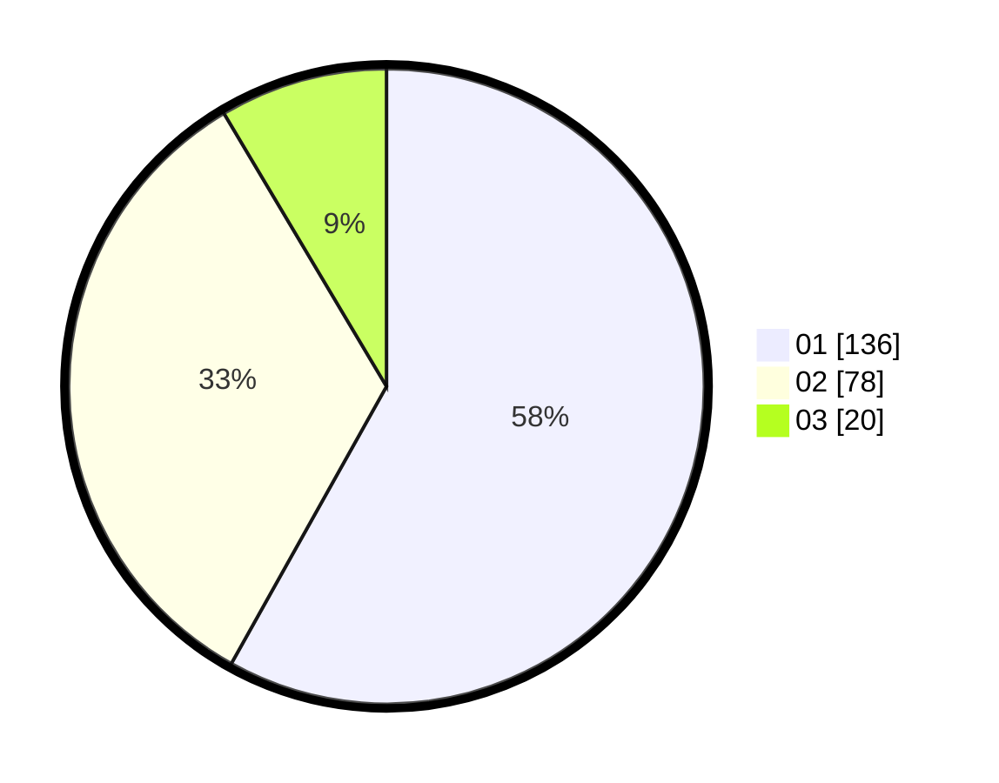

# Hasil

Hasil perolehan suara paslon dapat dilihat pada file paslon-01.txt, paslon-02.txt, dan paslon-03.txt.

Jika tidak ada, artinya data tersebut belum ada pada SIREKAP.

## Perolehan Suara

 * Paslon 01: **136**.
 * Paslon 02: **78**.
 * Paslon 03: **20**.

## Foto C Plano

https://sirekap-obj-formc.kpu.go.id/148b/pemilu/ppwp/31/75/02/10/03/3175021003015-20240214-185007--bd129518-4aaa-4f5e-8eef-d05501d3242a.jpg

https://sirekap-obj-formc.kpu.go.id/148b/pemilu/ppwp/31/75/02/10/03/3175021003015-20240214-184552--40e731f4-af22-4956-9418-ff43a2917b7b.jpg

https://sirekap-obj-formc.kpu.go.id/148b/pemilu/ppwp/31/75/02/10/03/3175021003015-20240217-220942--1f0d5210-6511-4d39-bca1-4e6bfa6b49aa.jpg

## DATA PEMILIH TETAP

Jumlah pemilih dalam DPT: **284**.
 * L: **138**.
 * P: **146**.

## DATA PENGGUNA HAK PILIH

Jumlah pengguna hak pilih dalam DPT: **232**.
 * L: **108**.
 * P: **124**.

Jumlah pengguna hak pilih dalam DPTb: **2**.
 * L: **2**.
 * P: **0**.

Jumlah pengguna hak pilih dalam DPK: **2**.
 * L: **2**.
 * P: **0**.

Jumlah pengguna hak pilih: **2**.
 * L: **2**.
 * P: **0**.

## JUMLAH SUARA SAH DAN TIDAK SAH

JUMLAH SELURUH SUARA SAH: **234**.

JUMLAH SUARA TIDAK SAH: **2**.

JUMLAH SELURUH SUARA SAH DAN SUARA TIDAK SAH: **236**.
