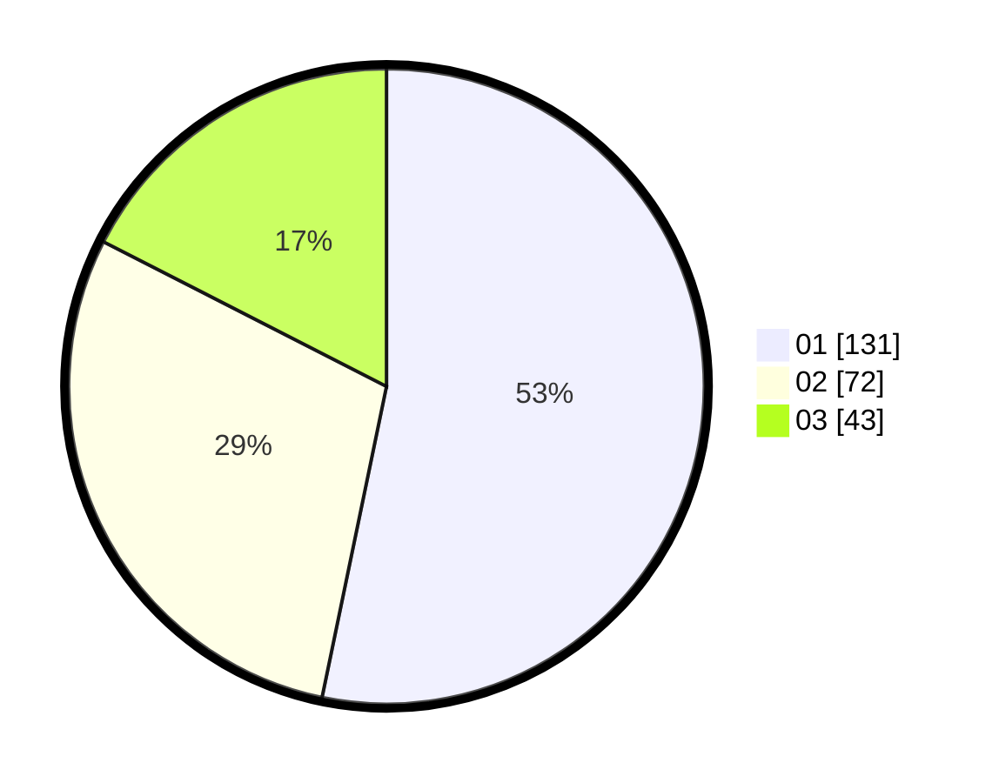

# Hasil

Hasil perolehan suara paslon dapat dilihat pada file paslon-01.txt, paslon-02.txt, dan paslon-03.txt.

Jika tidak ada, artinya data tersebut belum ada pada SIREKAP.

## Perolehan Suara

 * Paslon 01: **131**.
 * Paslon 02: **72**.
 * Paslon 03: **43**.

## Foto C Plano

https://sirekap-obj-formc.kpu.go.id/be1d/pemilu/ppwp/31/75/02/10/03/3175021003018-20240215-021243--d3f8d810-e52a-4689-bdd7-19a6a90afcc4.jpg

https://sirekap-obj-formc.kpu.go.id/be1d/pemilu/ppwp/31/75/02/10/03/3175021003018-20240215-020840--aaa81f60-0c50-4ff7-a777-1fac146d9c72.jpg

https://sirekap-obj-formc.kpu.go.id/be1d/pemilu/ppwp/31/75/02/10/03/3175021003018-20240215-020408--85b39c9d-8d3b-49c0-9799-52ec1e358552.jpg
