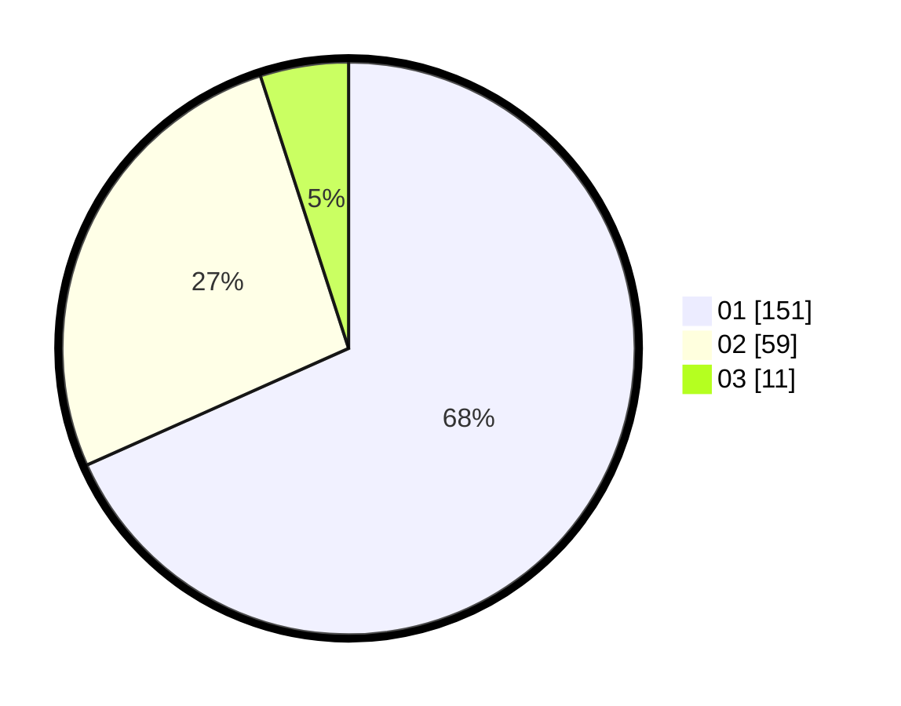

# Hasil

Hasil perolehan suara paslon dapat dilihat pada file paslon-01.txt, paslon-02.txt, dan paslon-03.txt.

Jika tidak ada, artinya data tersebut belum ada pada SIREKAP.

## Perolehan Suara

 * Paslon 01: **151**.
 * Paslon 02: **59**.
 * Paslon 03: **11**.

## Foto C Plano

https://sirekap-obj-formc.kpu.go.id/6780/pemilu/ppwp/31/75/02/10/03/3175021003020-20240215-003413--8a91f010-271d-4d55-99ef-fcc2216243b4.jpg

https://sirekap-obj-formc.kpu.go.id/6780/pemilu/ppwp/31/75/02/10/03/3175021003020-20240215-003655--dca16846-cc4b-42a3-a4bf-665fc053ff2b.jpg

https://sirekap-obj-formc.kpu.go.id/6780/pemilu/ppwp/31/75/02/10/03/3175021003020-20240215-003914--fff97ac1-a293-4382-b03a-ef3ef4c04e9d.jpg
