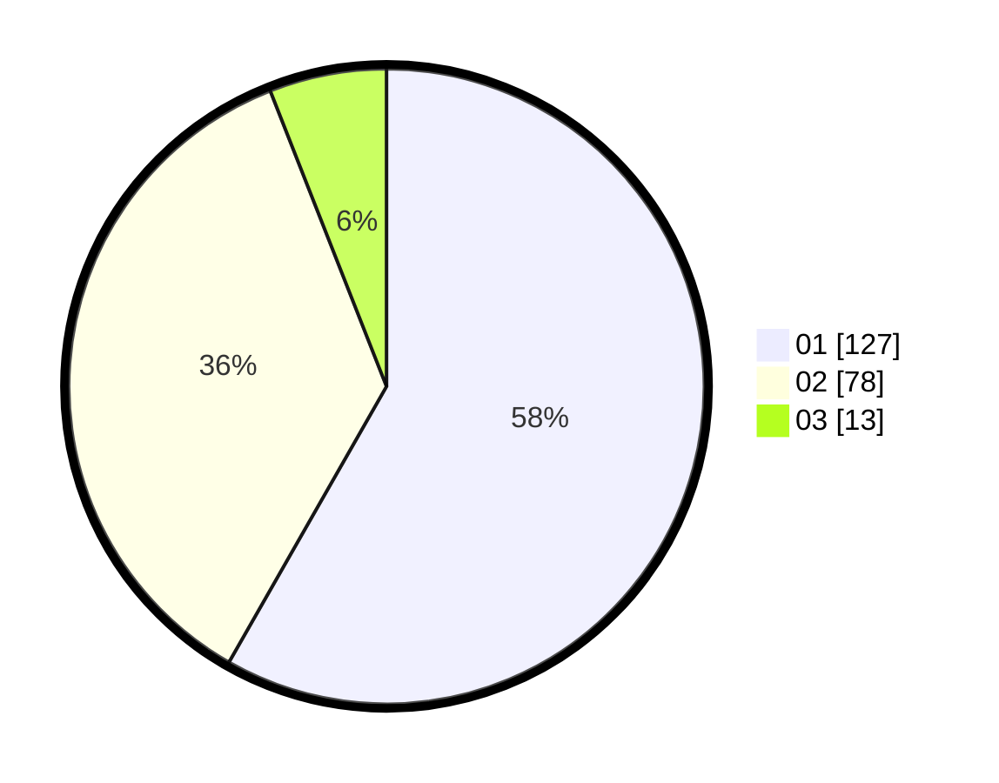

# Hasil

Hasil perolehan suara paslon dapat dilihat pada file paslon-01.txt, paslon-02.txt, dan paslon-03.txt.

Jika tidak ada, artinya data tersebut belum ada pada SIREKAP.

## Perolehan Suara

 * Paslon 01: **127**.
 * Paslon 02: **78**.
 * Paslon 03: **13**.

## Foto C Plano

https://sirekap-obj-formc.kpu.go.id/6219/pemilu/ppwp/31/75/02/10/03/3175021003027-20240215-013839--f9409408-16c5-46e2-9dbd-cb487c8abda6.jpg

https://sirekap-obj-formc.kpu.go.id/6219/pemilu/ppwp/31/75/02/10/03/3175021003027-20240215-033453--38352508-b728-45a3-a9c3-1eae5e09d50f.jpg

https://sirekap-obj-formc.kpu.go.id/6219/pemilu/ppwp/31/75/02/10/03/3175021003027-20240215-033532--5394101e-a527-4fe9-8652-30c403e2ed63.jpg

## DATA PEMILIH TETAP

Jumlah pemilih dalam DPT: **50**.
 * L: **132**.
 * P: **124**.

## DATA PENGGUNA HAK PILIH

Jumlah pengguna hak pilih dalam DPT: **224**.
 * L: **107**.
 * P: **111**.

Jumlah pengguna hak pilih dalam DPTb: **0**.
 * L: **0**.
 * P: **0**.

Jumlah pengguna hak pilih dalam DPK: **0**.
 * L: **0**.
 * P: **0**.

Jumlah pengguna hak pilih: **218**.
 * L: **107**.
 * P: **111**.

## JUMLAH SUARA SAH DAN TIDAK SAH

JUMLAH SELURUH SUARA SAH: **218**.

JUMLAH SUARA TIDAK SAH: **0**.

JUMLAH SELURUH SUARA SAH DAN SUARA TIDAK SAH: **218**.
