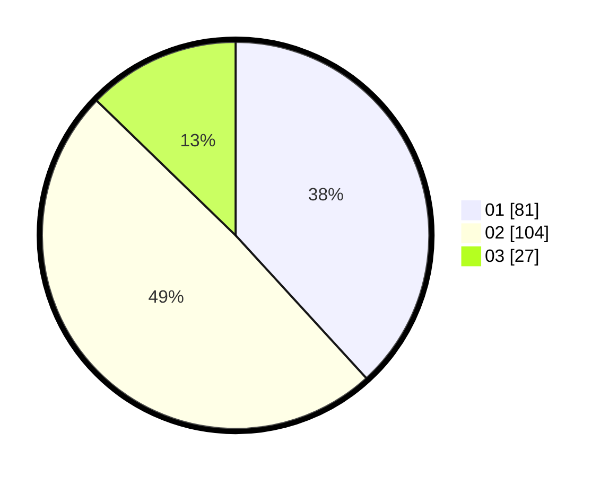

# Hasil

Hasil perolehan suara paslon dapat dilihat pada file paslon-01.txt, paslon-02.txt, dan paslon-03.txt.

Jika tidak ada, artinya data tersebut belum ada pada SIREKAP.

## Perolehan Suara

 * Paslon 01: **81**.
 * Paslon 02: **104**.
 * Paslon 03: **27**.

## Foto C Plano

https://sirekap-obj-formc.kpu.go.id/9fc2/pemilu/ppwp/31/75/02/10/03/3175021003030-20240214-234326--0844d7de-19bc-4fb4-bd40-f8916b12dc21.jpg

https://sirekap-obj-formc.kpu.go.id/9fc2/pemilu/ppwp/31/75/02/10/03/3175021003030-20240215-003041--f19f2b76-4950-4cf8-8c67-861b71a9b95f.jpg

https://sirekap-obj-formc.kpu.go.id/9fc2/pemilu/ppwp/31/75/02/10/03/3175021003030-20240215-005851--e647d1cb-a636-4de7-9a4b-439de8aaa85d.jpg
