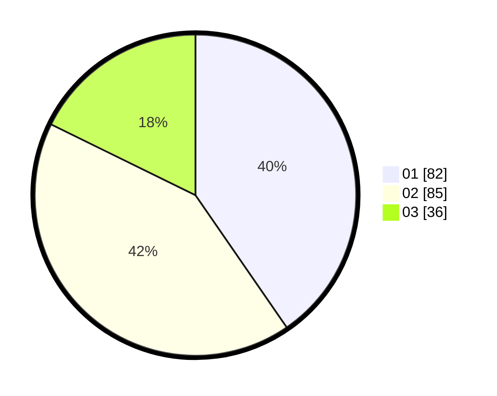

# Hasil

Hasil perolehan suara paslon dapat dilihat pada file paslon-01.txt, paslon-02.txt, dan paslon-03.txt.

Jika tidak ada, artinya data tersebut belum ada pada SIREKAP.

## Perolehan Suara

 * Paslon 01: **82**.
 * Paslon 02: **85**.
 * Paslon 03: **36**.

## Foto C Plano

https://sirekap-obj-formc.kpu.go.id/3fff/pemilu/ppwp/31/75/02/10/03/3175021003033-20240215-170333--2b980e83-08c4-4eab-837d-d3f10eb2bf08.jpg

https://sirekap-obj-formc.kpu.go.id/3fff/pemilu/ppwp/31/75/02/10/03/3175021003033-20240215-170337--9eb7e26b-a897-4b8b-a69f-ddefd94f9aca.jpg

https://sirekap-obj-formc.kpu.go.id/3fff/pemilu/ppwp/31/75/02/10/03/3175021003033-20240215-170341--96c73004-03f9-413f-bfe3-a4d4730e9268.jpg
