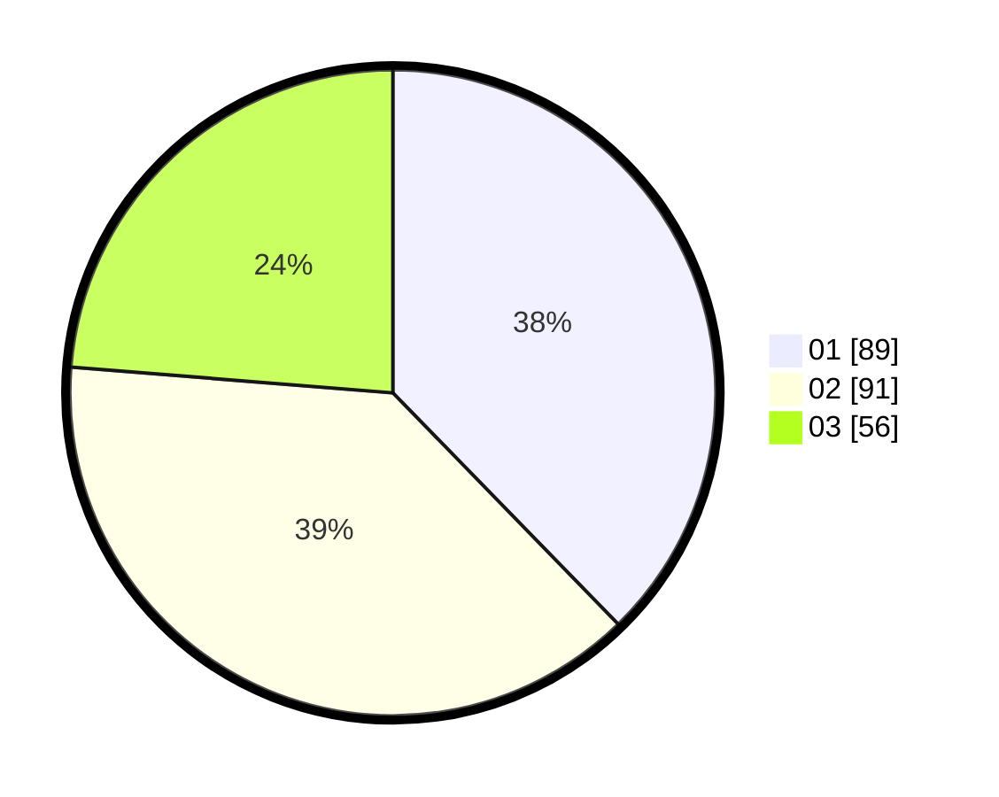

# Hasil

Hasil perolehan suara paslon dapat dilihat pada file paslon-01.txt, paslon-02.txt, dan paslon-03.txt.

Jika tidak ada, artinya data tersebut belum ada pada SIREKAP.

## Perolehan Suara

 * Paslon 01: **89**.
 * Paslon 02: **91**.
 * Paslon 03: **56**.

## Foto C Plano

https://sirekap-obj-formc.kpu.go.id/e901/pemilu/ppwp/31/75/02/10/03/3175021003035-20240214-220500--2bb7951c-724b-40c5-8d16-a771f4ae3fbe.jpg

https://sirekap-obj-formc.kpu.go.id/e901/pemilu/ppwp/31/75/02/10/03/3175021003035-20240214-220523--54acc67b-a5ef-4bb3-9a24-67dbb00bb1d2.jpg

https://sirekap-obj-formc.kpu.go.id/e901/pemilu/ppwp/31/75/02/10/03/3175021003035-20240214-220547--a5be1fd9-ffff-4a04-81f3-30d5378602df.jpg
