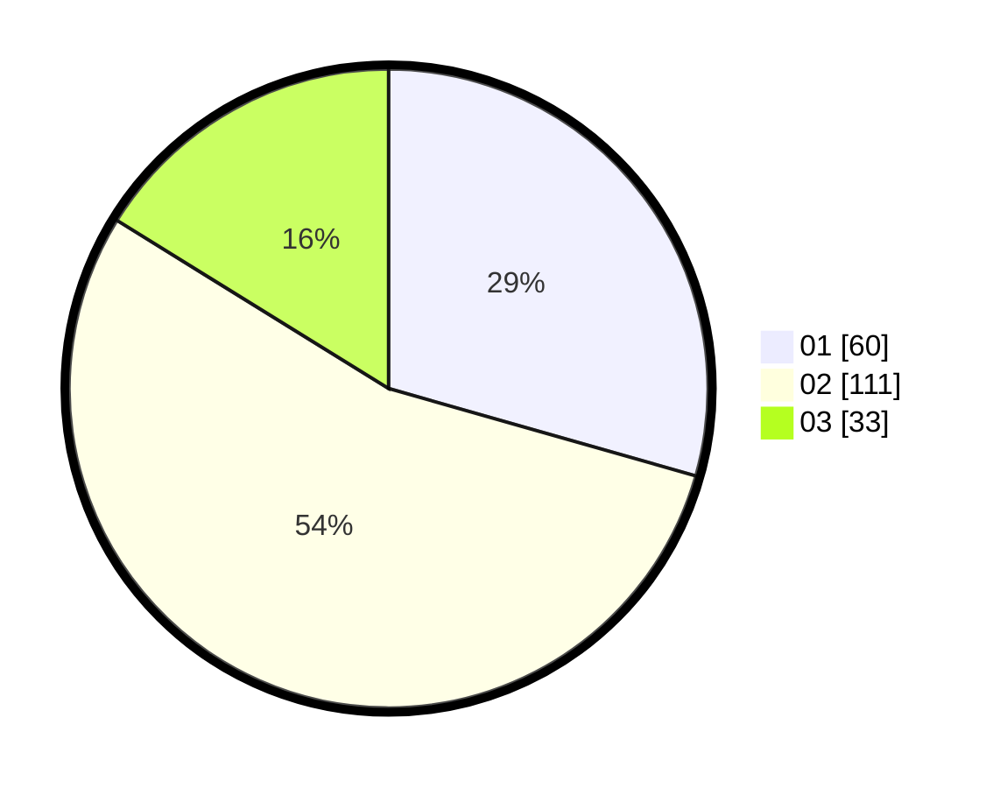

# Hasil

Hasil perolehan suara paslon dapat dilihat pada file paslon-01.txt, paslon-02.txt, dan paslon-03.txt.

Jika tidak ada, artinya data tersebut belum ada pada SIREKAP.

## Perolehan Suara

 * Paslon 01: **60**.
 * Paslon 02: **111**.
 * Paslon 03: **33**.

## Foto C Plano

https://sirekap-obj-formc.kpu.go.id/c3c2/pemilu/ppwp/31/75/02/10/03/3175021003042-20240214-221920--a6da1a48-32eb-48ab-9ff0-5922740ae47a.jpg

https://sirekap-obj-formc.kpu.go.id/c3c2/pemilu/ppwp/31/75/02/10/03/3175021003042-20240214-193614--7614850b-ec0e-4bac-b1fc-f50794c64df9.jpg

https://sirekap-obj-formc.kpu.go.id/c3c2/pemilu/ppwp/31/75/02/10/03/3175021003042-20240214-193509--73b775f0-d8ac-4ff3-ac4e-dffbd9c9bdc1.jpg

## DATA PEMILIH TETAP

Jumlah pemilih dalam DPT: **261**.
 * L: **98**.
 * P: **163**.

## DATA PENGGUNA HAK PILIH

Jumlah pengguna hak pilih dalam DPT: **206**.
 * L: **73**.
 * P: **133**.

Jumlah pengguna hak pilih dalam DPTb: **1**.
 * L: **0**.
 * P: **1**.

Jumlah pengguna hak pilih dalam DPK: **0**.
 * L: **0**.
 * P: **0**.

Jumlah pengguna hak pilih: **207**.
 * L: **73**.
 * P: **134**.

## JUMLAH SUARA SAH DAN TIDAK SAH

JUMLAH SELURUH SUARA SAH: **204**.

JUMLAH SUARA TIDAK SAH: **3**.

JUMLAH SELURUH SUARA SAH DAN SUARA TIDAK SAH: **207**.
