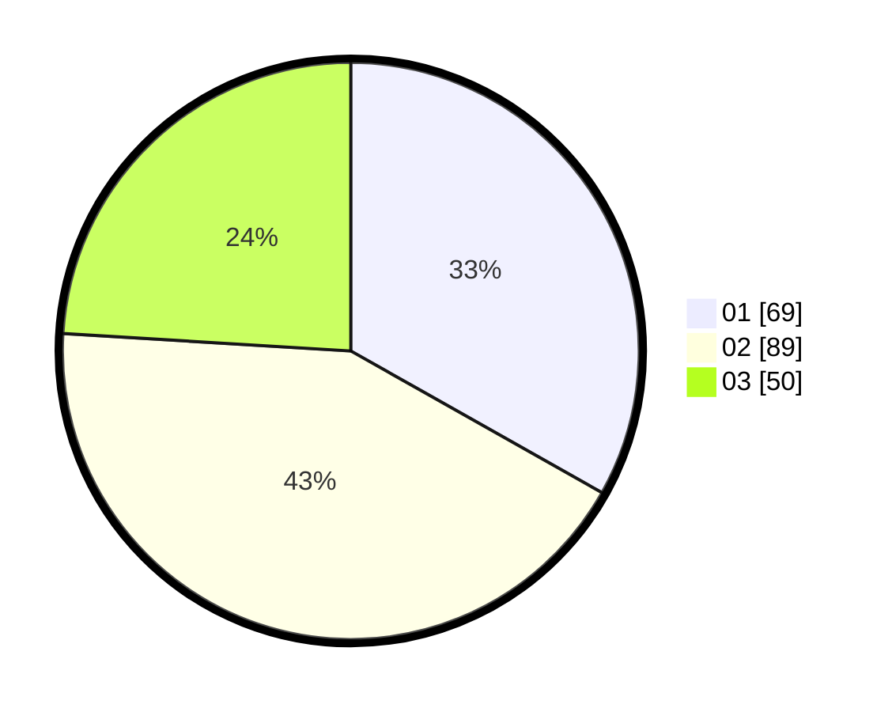

# Hasil

Hasil perolehan suara paslon dapat dilihat pada file paslon-01.txt, paslon-02.txt, dan paslon-03.txt.

Jika tidak ada, artinya data tersebut belum ada pada SIREKAP.

## Perolehan Suara

 * Paslon 01: **69**.
 * Paslon 02: **89**.
 * Paslon 03: **50**.

## Foto C Plano

https://sirekap-obj-formc.kpu.go.id/dad7/pemilu/ppwp/31/75/02/10/03/3175021003045-20240216-131455--41fe0b35-21d4-4a14-a1b1-6dbb73209585.jpg

https://sirekap-obj-formc.kpu.go.id/dad7/pemilu/ppwp/31/75/02/10/03/3175021003045-20240214-235940--8f22e7b8-d540-430a-941b-a8c84d551aea.jpg

https://sirekap-obj-formc.kpu.go.id/dad7/pemilu/ppwp/31/75/02/10/03/3175021003045-20240215-000059--e4191a5a-3bf2-4ca6-8938-68c75b8b3d1c.jpg

## DATA PEMILIH TETAP

Jumlah pemilih dalam DPT: **261**.
 * L: **114**.
 * P: **147**.

## DATA PENGGUNA HAK PILIH

Jumlah pengguna hak pilih dalam DPT: **212**.
 * L: **85**.
 * P: **127**.

Jumlah pengguna hak pilih dalam DPTb: **1**.
 * L: **0**.
 * P: **1**.

Jumlah pengguna hak pilih dalam DPK: **0**.
 * L: **0**.
 * P: **0**.

Jumlah pengguna hak pilih: **213**.
 * L: **85**.
 * P: **128**.

## JUMLAH SUARA SAH DAN TIDAK SAH

JUMLAH SELURUH SUARA SAH: **208**.

JUMLAH SUARA TIDAK SAH: **5**.

JUMLAH SELURUH SUARA SAH DAN SUARA TIDAK SAH: **213**.
