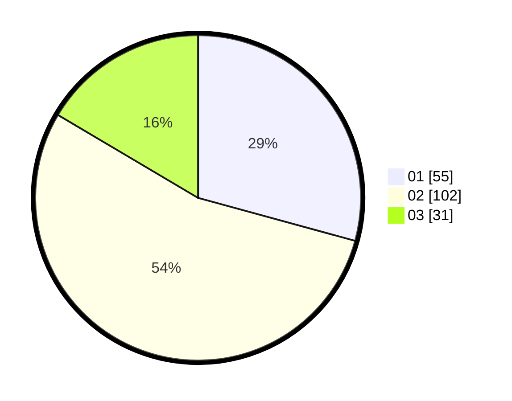

# Hasil

Hasil perolehan suara paslon dapat dilihat pada file paslon-01.txt, paslon-02.txt, dan paslon-03.txt.

Jika tidak ada, artinya data tersebut belum ada pada SIREKAP.

## Perolehan Suara

 * Paslon 01: **55**.
 * Paslon 02: **102**.
 * Paslon 03: **31**.

## Foto C Plano

https://sirekap-obj-formc.kpu.go.id/6c27/pemilu/ppwp/31/75/02/10/03/3175021003047-20240217-080956--ec259ff0-c1e2-4762-ac45-12ee57060744.jpg

https://sirekap-obj-formc.kpu.go.id/6c27/pemilu/ppwp/31/75/02/10/03/3175021003047-20240215-012225--fa1cae63-9e81-4127-8714-b7703ebd2f46.jpg

https://sirekap-obj-formc.kpu.go.id/6c27/pemilu/ppwp/31/75/02/10/03/3175021003047-20240217-083547--fe9a488c-5228-449b-9794-36ed15e87d26.jpg
