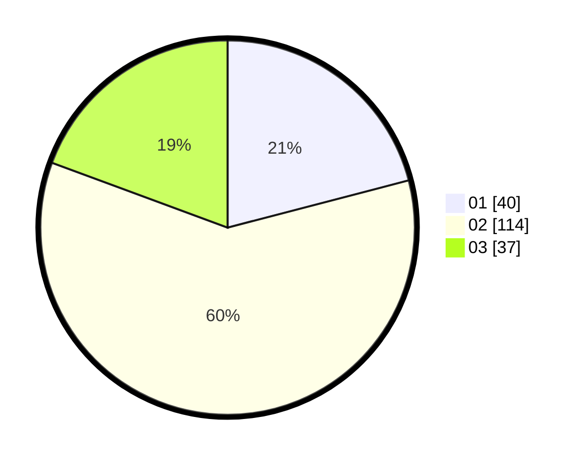

# Hasil

Hasil perolehan suara paslon dapat dilihat pada file paslon-01.txt, paslon-02.txt, dan paslon-03.txt.

Jika tidak ada, artinya data tersebut belum ada pada SIREKAP.

## Perolehan Suara

 * Paslon 01: **40**.
 * Paslon 02: **114**.
 * Paslon 03: **37**.

## Foto C Plano

https://sirekap-obj-formc.kpu.go.id/b739/pemilu/ppwp/31/75/02/10/03/3175021003049-20240216-114625--bf6e3bf8-67a9-4c3d-b0bd-4e0e6c20102c.jpg

https://sirekap-obj-formc.kpu.go.id/b739/pemilu/ppwp/31/75/02/10/03/3175021003049-20240216-114626--20821c19-add5-4769-b896-fded14ae7cae.jpg

https://sirekap-obj-formc.kpu.go.id/b739/pemilu/ppwp/31/75/02/10/03/3175021003049-20240216-114625--41bc3700-2a37-4196-bfd2-cb68ad1067c9.jpg

## DATA PEMILIH TETAP

Jumlah pemilih dalam DPT: **265**.
 * L: **122**.
 * P: **143**.

## DATA PENGGUNA HAK PILIH

Jumlah pengguna hak pilih dalam DPT: **193**.
 * L: **86**.
 * P: **107**.

Jumlah pengguna hak pilih dalam DPTb: **1**.
 * L: **1**.
 * P: **0**.

Jumlah pengguna hak pilih dalam DPK: **0**.
 * L: **0**.
 * P: **0**.

Jumlah pengguna hak pilih: **194**.
 * L: **87**.
 * P: **107**.

## JUMLAH SUARA SAH DAN TIDAK SAH

JUMLAH SELURUH SUARA SAH: **191**.

JUMLAH SUARA TIDAK SAH: **3**.

JUMLAH SELURUH SUARA SAH DAN SUARA TIDAK SAH: **194**.
