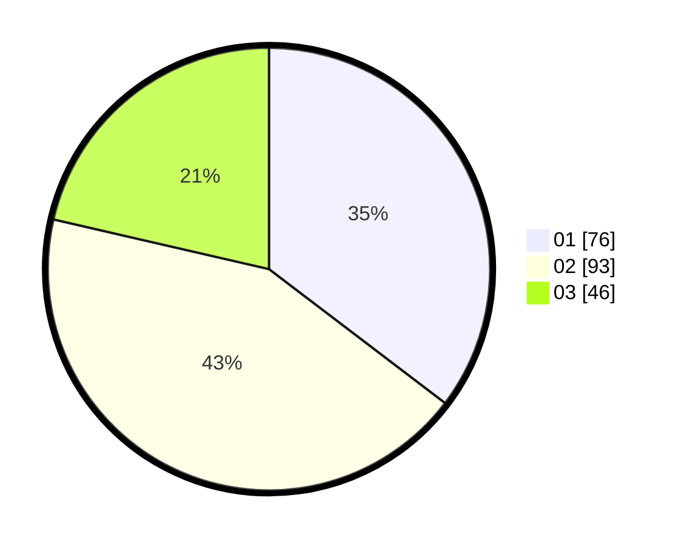

# Hasil

Hasil perolehan suara paslon dapat dilihat pada file paslon-01.txt, paslon-02.txt, dan paslon-03.txt.

Jika tidak ada, artinya data tersebut belum ada pada SIREKAP.

## Perolehan Suara

 * Paslon 01: **76**.
 * Paslon 02: **93**.
 * Paslon 03: **46**.

## Foto C Plano

https://sirekap-obj-formc.kpu.go.id/df0d/pemilu/ppwp/31/75/02/10/03/3175021003051-20240214-212439--087f1d6c-e663-4097-ab0d-dd8b25fbdc4b.jpg

https://sirekap-obj-formc.kpu.go.id/df0d/pemilu/ppwp/31/75/02/10/03/3175021003051-20240214-212632--9e432c7a-d7d8-4ffc-8386-1b825b8d12db.jpg

https://sirekap-obj-formc.kpu.go.id/df0d/pemilu/ppwp/31/75/02/10/03/3175021003051-20240214-212828--176f2300-a561-45a3-9060-7f4e6f7c8e7a.jpg

## DATA PEMILIH TETAP

Jumlah pemilih dalam DPT: **261**.
 * L: **123**.
 * P: **138**.

## DATA PENGGUNA HAK PILIH

Jumlah pengguna hak pilih dalam DPT: **215**.
 * L: **99**.
 * P: **116**.

Jumlah pengguna hak pilih dalam DPTb: **2**.
 * L: **1**.
 * P: **1**.

Jumlah pengguna hak pilih dalam DPK: **3**.
 * L: **2**.
 * P: **1**.

Jumlah pengguna hak pilih: **220**.
 * L: **102**.
 * P: **118**.

## JUMLAH SUARA SAH DAN TIDAK SAH

JUMLAH SELURUH SUARA SAH: **215**.

JUMLAH SUARA TIDAK SAH: **5**.

JUMLAH SELURUH SUARA SAH DAN SUARA TIDAK SAH: **220**.
