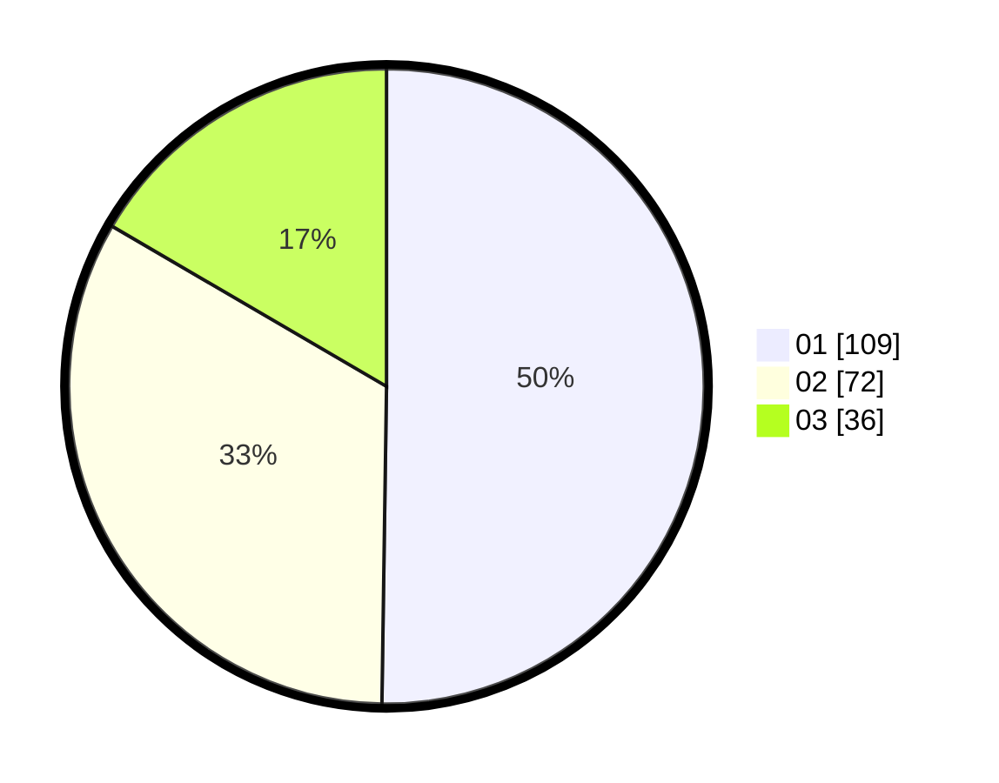

# Hasil

Hasil perolehan suara paslon dapat dilihat pada file paslon-01.txt, paslon-02.txt, dan paslon-03.txt.

Jika tidak ada, artinya data tersebut belum ada pada SIREKAP.

## Perolehan Suara

 * Paslon 01: **109**.
 * Paslon 02: **72**.
 * Paslon 03: **36**.

## Foto C Plano

https://sirekap-obj-formc.kpu.go.id/9c5e/pemilu/ppwp/31/75/02/10/03/3175021003053-20240218-015702--0050e30e-fde9-4aa6-a73f-2f1fb670cfb8.jpg

https://sirekap-obj-formc.kpu.go.id/9c5e/pemilu/ppwp/31/75/02/10/03/3175021003053-20240218-165645--162959c1-e4ad-434d-85b3-18feaf4d5545.jpg

https://sirekap-obj-formc.kpu.go.id/9c5e/pemilu/ppwp/31/75/02/10/03/3175021003053-20240218-165926--0b43db37-e2f5-4d66-947b-dc4853e21156.jpg

## DATA PEMILIH TETAP

Jumlah pemilih dalam DPT: **268**.
 * L: **132**.
 * P: **136**.

## DATA PENGGUNA HAK PILIH

Jumlah pengguna hak pilih dalam DPT: **208**.
 * L: **101**.
 * P: **107**.

Jumlah pengguna hak pilih dalam DPTb: **8**.
 * L: **3**.
 * P: **5**.

Jumlah pengguna hak pilih dalam DPK: **2**.
 * L: **0**.
 * P: **2**.

Jumlah pengguna hak pilih: **218**.
 * L: **104**.
 * P: **114**.

## JUMLAH SUARA SAH DAN TIDAK SAH

JUMLAH SELURUH SUARA SAH: **217**.

JUMLAH SUARA TIDAK SAH: **2**.

JUMLAH SELURUH SUARA SAH DAN SUARA TIDAK SAH: **219**.
