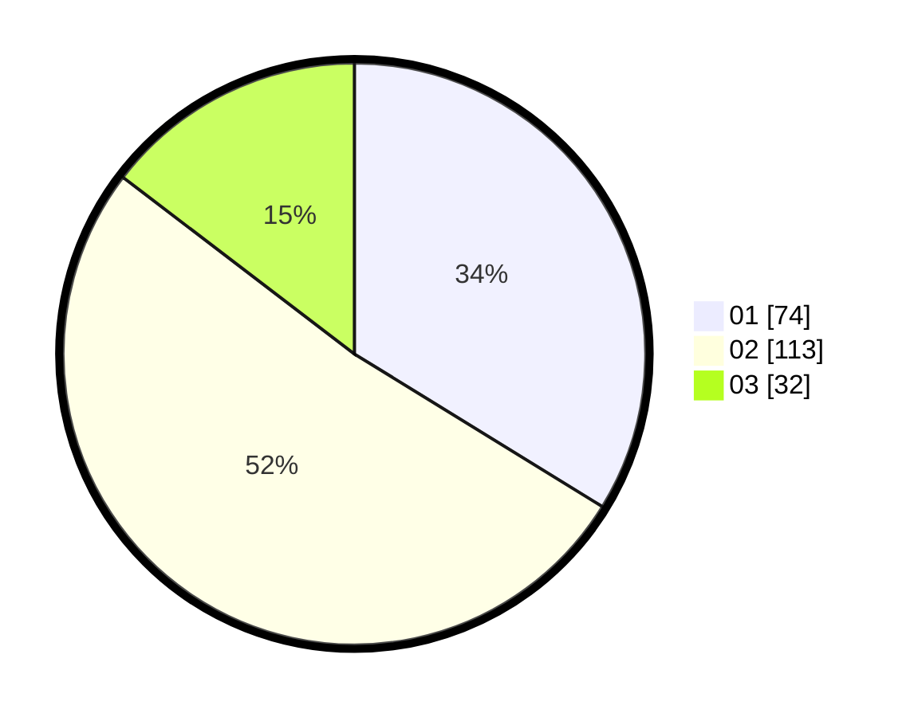

# Hasil

Hasil perolehan suara paslon dapat dilihat pada file paslon-01.txt, paslon-02.txt, dan paslon-03.txt.

Jika tidak ada, artinya data tersebut belum ada pada SIREKAP.

## Perolehan Suara

 * Paslon 01: **74**.
 * Paslon 02: **113**.
 * Paslon 03: **32**.

## Foto C Plano

https://sirekap-obj-formc.kpu.go.id/d2a9/pemilu/ppwp/31/75/02/10/03/3175021003055-20240215-020255--95ec3204-fae5-43e8-8ac1-53b6b8fed760.jpg

https://sirekap-obj-formc.kpu.go.id/d2a9/pemilu/ppwp/31/75/02/10/03/3175021003055-20240214-194315--21b53af1-c3d0-4862-82e1-53fb2b348573.jpg

https://sirekap-obj-formc.kpu.go.id/d2a9/pemilu/ppwp/31/75/02/10/03/3175021003055-20240214-191146--c14da508-f7b4-428c-90d3-7ba9b3015d38.jpg
