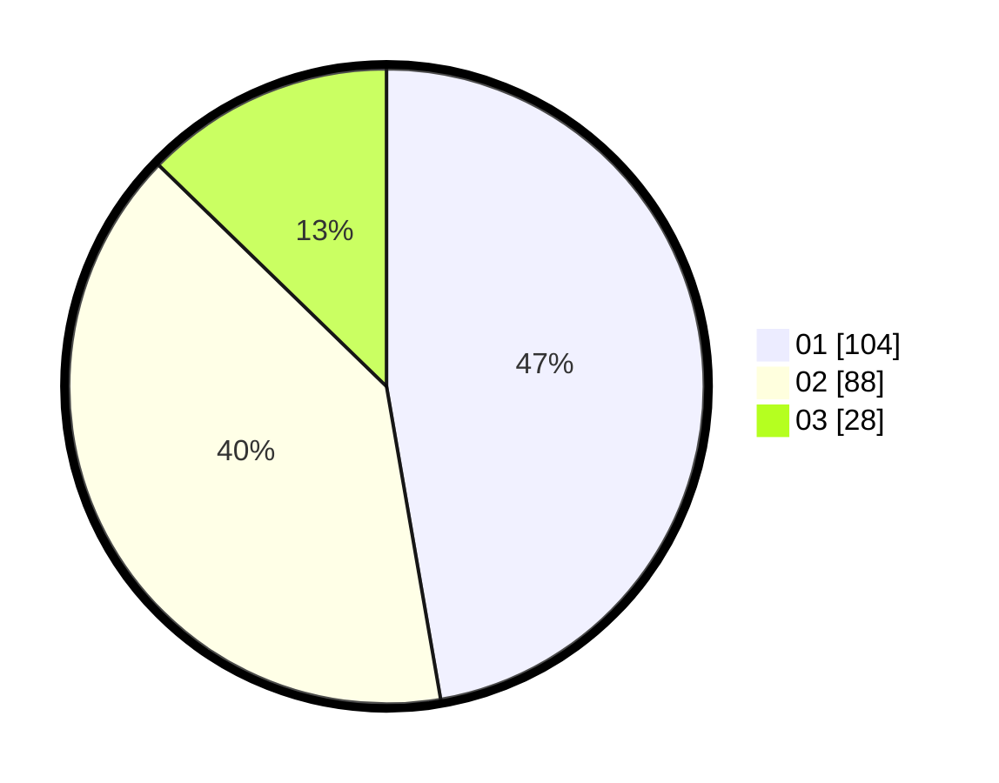

# Hasil

Hasil perolehan suara paslon dapat dilihat pada file paslon-01.txt, paslon-02.txt, dan paslon-03.txt.

Jika tidak ada, artinya data tersebut belum ada pada SIREKAP.

## Perolehan Suara

 * Paslon 01: **104**.
 * Paslon 02: **88**.
 * Paslon 03: **28**.

## Foto C Plano

https://sirekap-obj-formc.kpu.go.id/1ea9/pemilu/ppwp/31/75/02/10/03/3175021003056-20240214-220306--171404d6-40e7-46dc-88b1-bd2b5070f503.jpg

https://sirekap-obj-formc.kpu.go.id/1ea9/pemilu/ppwp/31/75/02/10/03/3175021003056-20240214-203204--7bcbb519-0db4-4095-88dc-ca8d75181361.jpg

https://sirekap-obj-formc.kpu.go.id/1ea9/pemilu/ppwp/31/75/02/10/03/3175021003056-20240214-221342--797c222a-7d62-4afe-a8d6-29fb1bc9025e.jpg

## DATA PEMILIH TETAP

Jumlah pemilih dalam DPT: **257**.
 * L: **129**.
 * P: **128**.

## DATA PENGGUNA HAK PILIH

Jumlah pengguna hak pilih dalam DPT: **218**.
 * L: **104**.
 * P: **114**.

Jumlah pengguna hak pilih dalam DPTb: **4**.
 * L: **2**.
 * P: **2**.

Jumlah pengguna hak pilih dalam DPK: **1**.
 * L: **0**.
 * P: **1**.

Jumlah pengguna hak pilih: **223**.
 * L: **106**.
 * P: **117**.

## JUMLAH SUARA SAH DAN TIDAK SAH

JUMLAH SELURUH SUARA SAH: **220**.

JUMLAH SUARA TIDAK SAH: **3**.

JUMLAH SELURUH SUARA SAH DAN SUARA TIDAK SAH: **223**.
