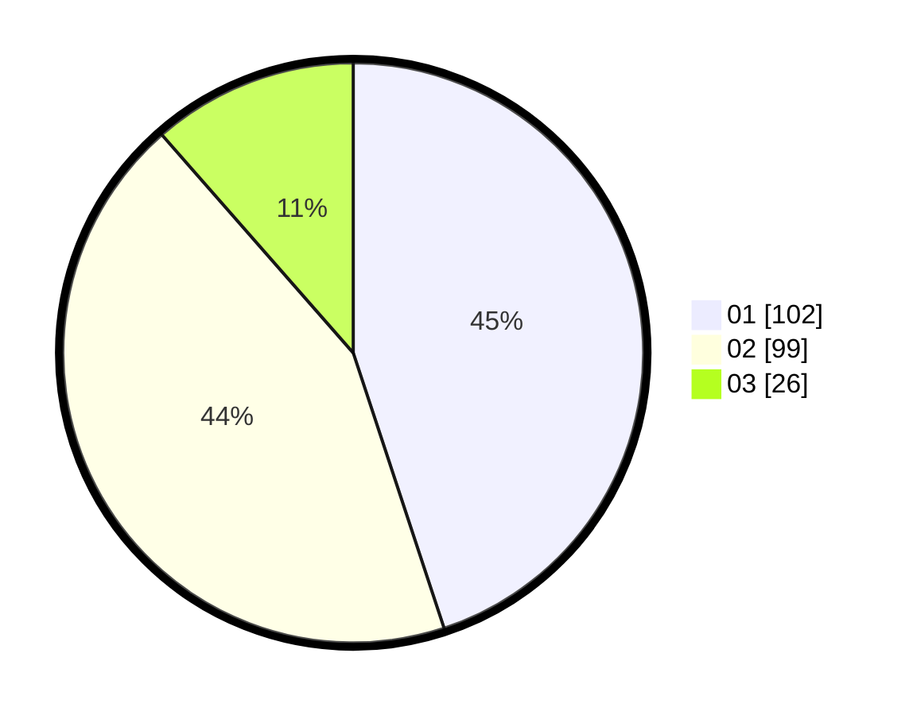

# Hasil

Hasil perolehan suara paslon dapat dilihat pada file paslon-01.txt, paslon-02.txt, dan paslon-03.txt.

Jika tidak ada, artinya data tersebut belum ada pada SIREKAP.

## Perolehan Suara

 * Paslon 01: **102**.
 * Paslon 02: **99**.
 * Paslon 03: **26**.

## Foto C Plano

https://sirekap-obj-formc.kpu.go.id/9060/pemilu/ppwp/31/75/02/10/03/3175021003061-20240214-160125--736ba746-de4a-4b9c-9133-affed3516903.jpg

https://sirekap-obj-formc.kpu.go.id/9060/pemilu/ppwp/31/75/02/10/03/3175021003061-20240216-181724--abfa2644-c2d5-463b-998c-9e300a3a95bf.jpg

https://sirekap-obj-formc.kpu.go.id/9060/pemilu/ppwp/31/75/02/10/03/3175021003061-20240217-204131--5685137f-e472-41f6-a6e2-fced6fcc77f4.jpg

## DATA PEMILIH TETAP

Jumlah pemilih dalam DPT: **289**.
 * L: **139**.
 * P: **150**.

## DATA PENGGUNA HAK PILIH

Jumlah pengguna hak pilih dalam DPT: **227**.
 * L: **103**.
 * P: **124**.

Jumlah pengguna hak pilih dalam DPTb: **0**.
 * L: **0**.
 * P: **0**.

Jumlah pengguna hak pilih dalam DPK: **0**.
 * L: **0**.
 * P: **0**.

Jumlah pengguna hak pilih: **227**.
 * L: **103**.
 * P: **124**.

## JUMLAH SUARA SAH DAN TIDAK SAH

JUMLAH SELURUH SUARA SAH: **227**.

JUMLAH SUARA TIDAK SAH: **0**.

JUMLAH SELURUH SUARA SAH DAN SUARA TIDAK SAH: **227**.
