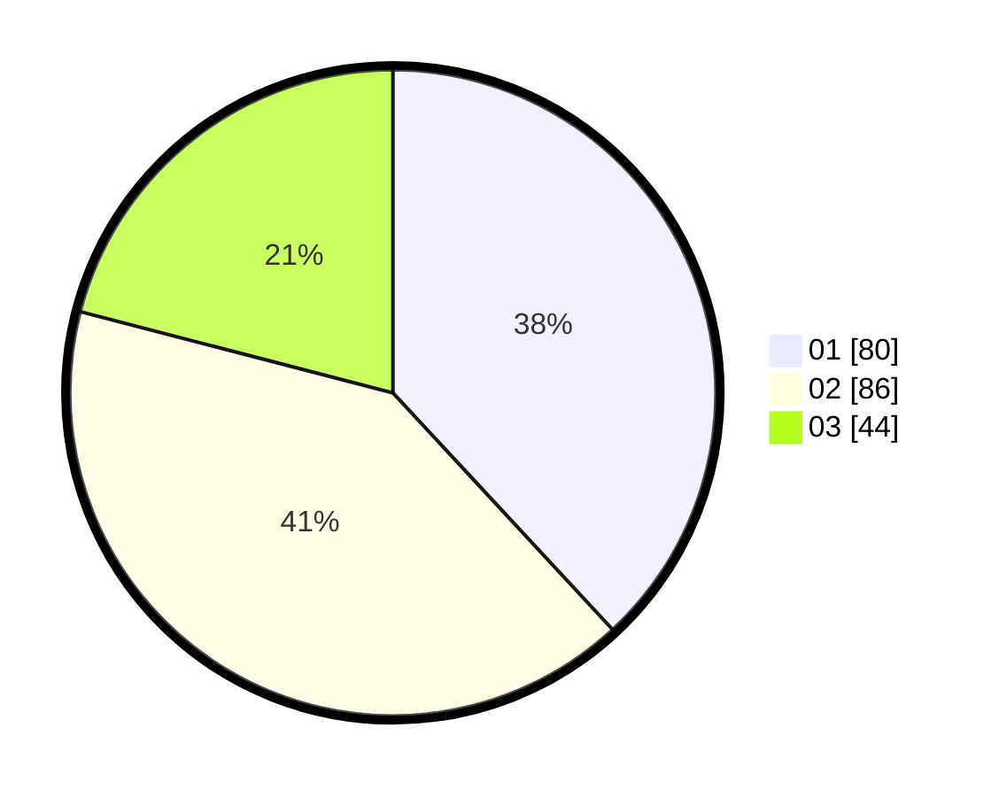

# Hasil

Hasil perolehan suara paslon dapat dilihat pada file paslon-01.txt, paslon-02.txt, dan paslon-03.txt.

Jika tidak ada, artinya data tersebut belum ada pada SIREKAP.

## Perolehan Suara

 * Paslon 01: **80**.
 * Paslon 02: **86**.
 * Paslon 03: **44**.

## Foto C Plano

https://sirekap-obj-formc.kpu.go.id/68d7/pemilu/ppwp/31/75/02/10/03/3175021003066-20240216-161244--26abf8c7-b8af-467e-ad37-d8af498ea721.jpg

https://sirekap-obj-formc.kpu.go.id/68d7/pemilu/ppwp/31/75/02/10/03/3175021003066-20240216-161245--9651a6a6-de44-4f8e-baa5-7ab32034bde4.jpg

https://sirekap-obj-formc.kpu.go.id/68d7/pemilu/ppwp/31/75/02/10/03/3175021003066-20240216-161245--c01dd624-dda2-4491-8d1d-6e1c8d0d27e2.jpg

## DATA PEMILIH TETAP

Jumlah pemilih dalam DPT: **288**.
 * L: **148**.
 * P: **140**.

## DATA PENGGUNA HAK PILIH

Jumlah pengguna hak pilih dalam DPT: **213**.
 * L: **104**.
 * P: **109**.

Jumlah pengguna hak pilih dalam DPTb: **0**.
 * L: **0**.
 * P: **0**.

Jumlah pengguna hak pilih dalam DPK: **2**.
 * L: **1**.
 * P: **1**.

Jumlah pengguna hak pilih: **215**.
 * L: **105**.
 * P: **110**.

## JUMLAH SUARA SAH DAN TIDAK SAH

JUMLAH SELURUH SUARA SAH: **210**.

JUMLAH SUARA TIDAK SAH: **5**.

JUMLAH SELURUH SUARA SAH DAN SUARA TIDAK SAH: **215**.
