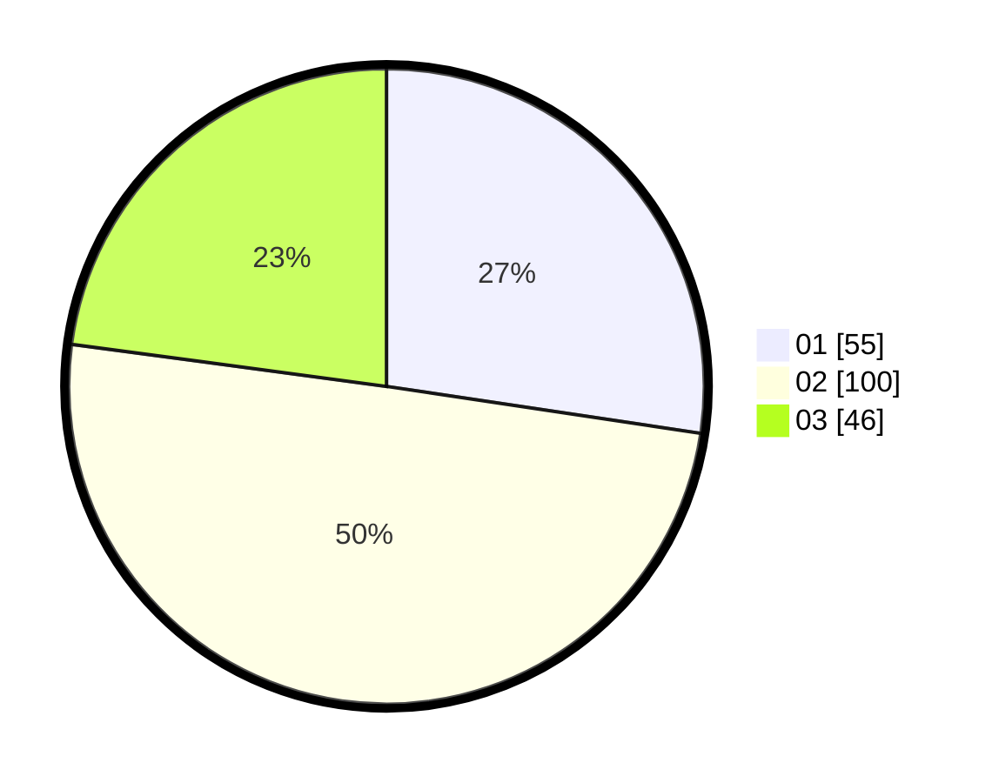

# Hasil

Hasil perolehan suara paslon dapat dilihat pada file paslon-01.txt, paslon-02.txt, dan paslon-03.txt.

Jika tidak ada, artinya data tersebut belum ada pada SIREKAP.

## Perolehan Suara

 * Paslon 01: **55**.
 * Paslon 02: **100**.
 * Paslon 03: **46**.

## Foto C Plano

https://sirekap-obj-formc.kpu.go.id/8781/pemilu/ppwp/31/75/02/10/03/3175021003067-20240215-013606--3e778c4e-da5d-42ff-a47c-22a8f89cced7.jpg

https://sirekap-obj-formc.kpu.go.id/8781/pemilu/ppwp/31/75/02/10/03/3175021003067-20240215-013628--fe3f2b8b-259f-46f6-9420-a63e47d4c845.jpg

https://sirekap-obj-formc.kpu.go.id/8781/pemilu/ppwp/31/75/02/10/03/3175021003067-20240215-013654--d6412f9c-52b6-4dac-8707-65dd210a5ab4.jpg
