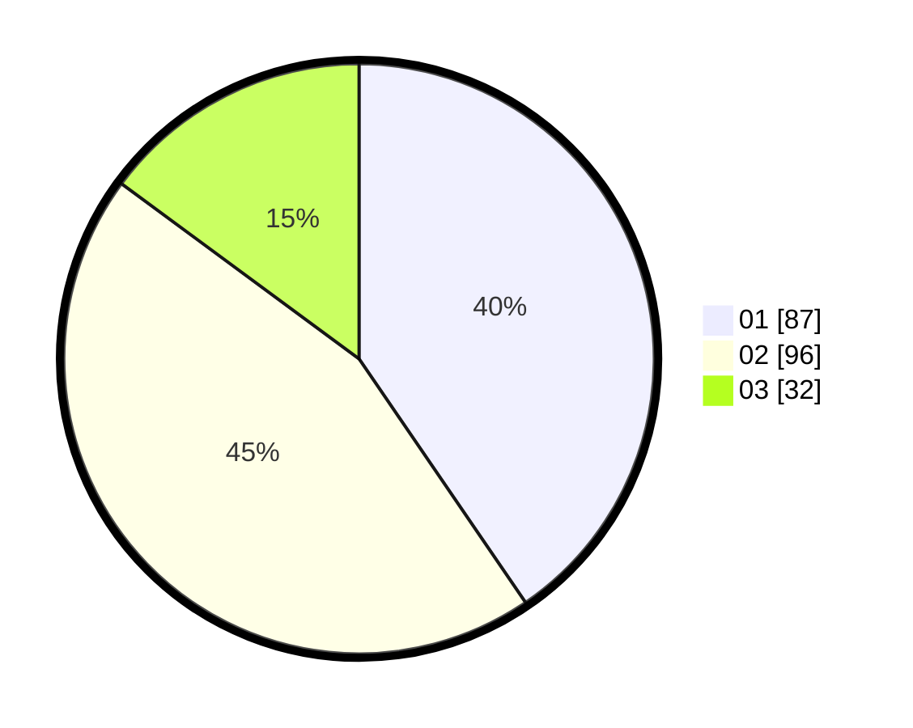

# Hasil

Hasil perolehan suara paslon dapat dilihat pada file paslon-01.txt, paslon-02.txt, dan paslon-03.txt.

Jika tidak ada, artinya data tersebut belum ada pada SIREKAP.

## Perolehan Suara

 * Paslon 01: **87**.
 * Paslon 02: **96**.
 * Paslon 03: **32**.

## Foto C Plano

https://sirekap-obj-formc.kpu.go.id/1168/pemilu/ppwp/31/75/02/10/03/3175021003069-20240214-224904--75d68c87-949d-4477-81e5-ea15d4d3238b.jpg

https://sirekap-obj-formc.kpu.go.id/1168/pemilu/ppwp/31/75/02/10/03/3175021003069-20240214-225104--9581bc9d-45de-41e8-b251-58e21b618837.jpg

https://sirekap-obj-formc.kpu.go.id/1168/pemilu/ppwp/31/75/02/10/03/3175021003069-20240214-225248--e5d50d95-86ad-41ad-a677-d6a355ff4824.jpg
