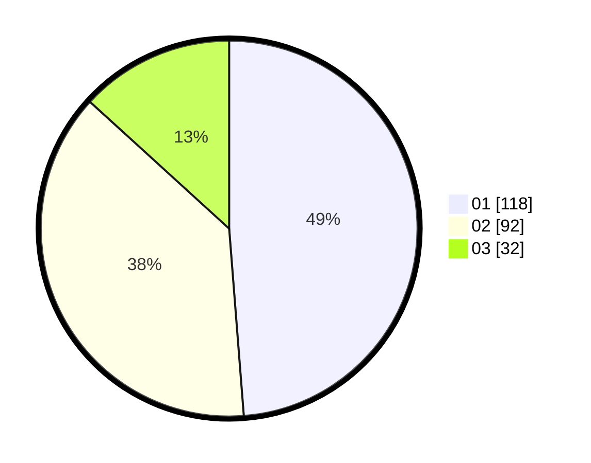

# Hasil

Hasil perolehan suara paslon dapat dilihat pada file paslon-01.txt, paslon-02.txt, dan paslon-03.txt.

Jika tidak ada, artinya data tersebut belum ada pada SIREKAP.

## Perolehan Suara

 * Paslon 01: **118**.
 * Paslon 02: **92**.
 * Paslon 03: **32**.

## Foto C Plano

https://sirekap-obj-formc.kpu.go.id/530a/pemilu/ppwp/31/75/02/10/03/3175021003071-20240215-003012--f68f92d4-e59f-45a3-87ca-939e9425b923.jpg

https://sirekap-obj-formc.kpu.go.id/530a/pemilu/ppwp/31/75/02/10/03/3175021003071-20240215-003056--18dc205a-e3ee-45f4-a6e6-9cf9522fba68.jpg

https://sirekap-obj-formc.kpu.go.id/530a/pemilu/ppwp/31/75/02/10/03/3175021003071-20240215-003129--4e4ab445-b085-46a7-955f-7fbece70e194.jpg

## DATA PEMILIH TETAP

Jumlah pemilih dalam DPT: **289**.
 * L: **134**.
 * P: **155**.

## DATA PENGGUNA HAK PILIH

Jumlah pengguna hak pilih dalam DPT: **242**.
 * L: **105**.
 * P: **137**.

Jumlah pengguna hak pilih dalam DPTb: **6**.
 * L: **2**.
 * P: **4**.

Jumlah pengguna hak pilih dalam DPK: **0**.
 * L: **0**.
 * P: **0**.

Jumlah pengguna hak pilih: **248**.
 * L: **107**.
 * P: **141**.

## JUMLAH SUARA SAH DAN TIDAK SAH

JUMLAH SELURUH SUARA SAH: **242**.

JUMLAH SUARA TIDAK SAH: **2**.

JUMLAH SELURUH SUARA SAH DAN SUARA TIDAK SAH: **244**.
