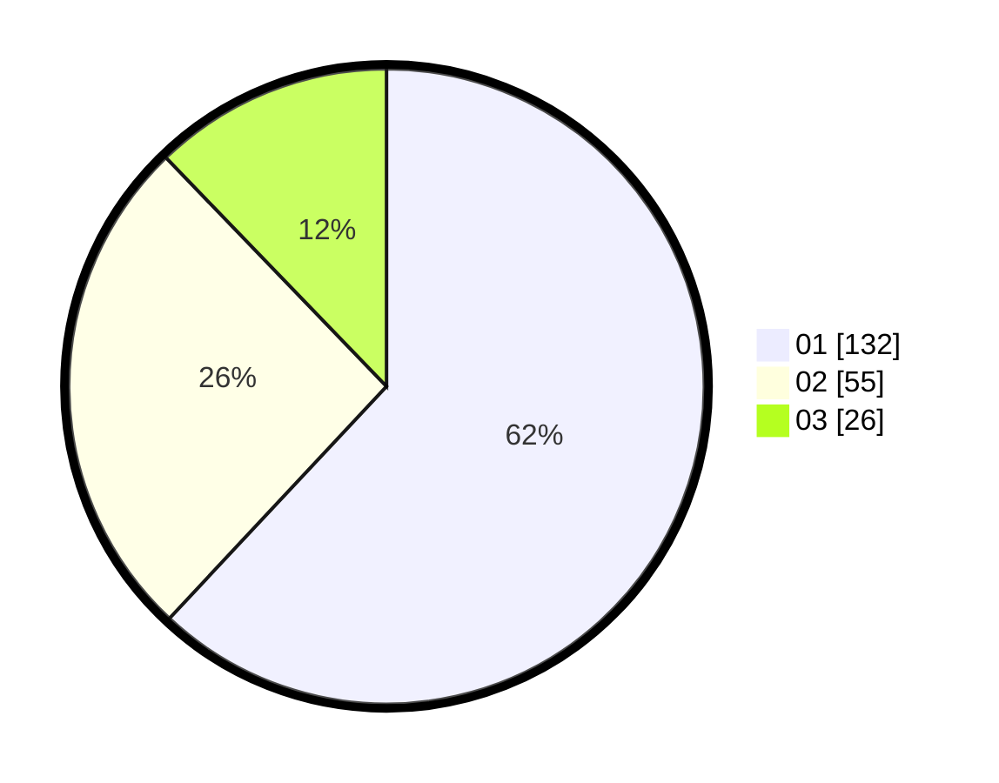

# Hasil

Hasil perolehan suara paslon dapat dilihat pada file paslon-01.txt, paslon-02.txt, dan paslon-03.txt.

Jika tidak ada, artinya data tersebut belum ada pada SIREKAP.

## Perolehan Suara

 * Paslon 01: **132**.
 * Paslon 02: **55**.
 * Paslon 03: **26**.

## Foto C Plano

https://sirekap-obj-formc.kpu.go.id/afb2/pemilu/ppwp/31/75/02/10/03/3175021003082-20240215-015832--09f13f28-e42f-4a20-a8a3-4bc732c144cd.jpg

https://sirekap-obj-formc.kpu.go.id/afb2/pemilu/ppwp/31/75/02/10/03/3175021003082-20240215-015643--83825eae-ca2a-4617-8a94-f687ab12d34b.jpg

https://sirekap-obj-formc.kpu.go.id/afb2/pemilu/ppwp/31/75/02/10/03/3175021003082-20240215-015540--2d463a1e-6713-47fc-b75a-24d8ade4c347.jpg
