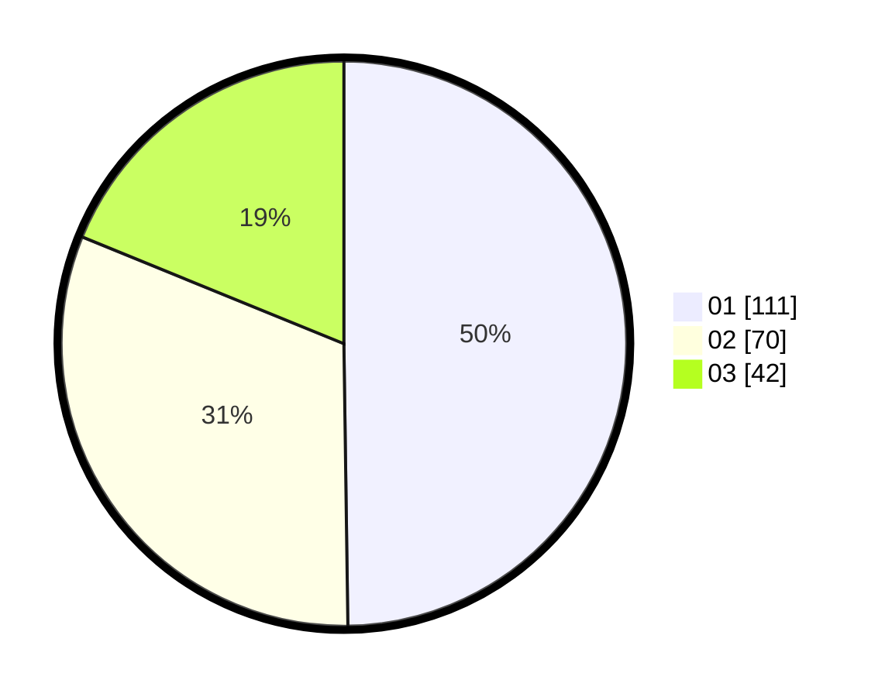

# Hasil

Hasil perolehan suara paslon dapat dilihat pada file paslon-01.txt, paslon-02.txt, dan paslon-03.txt.

Jika tidak ada, artinya data tersebut belum ada pada SIREKAP.

## Perolehan Suara

 * Paslon 01: **111**.
 * Paslon 02: **70**.
 * Paslon 03: **42**.

## Foto C Plano

https://sirekap-obj-formc.kpu.go.id/eb38/pemilu/ppwp/31/75/02/10/03/3175021003084-20240214-224949--a12dffb4-15e7-4d74-8d11-7aaaabc1b673.jpg

https://sirekap-obj-formc.kpu.go.id/eb38/pemilu/ppwp/31/75/02/10/03/3175021003084-20240214-225133--c08a653a-4e57-48ce-a8b2-64fa4c46b4e6.jpg

https://sirekap-obj-formc.kpu.go.id/eb38/pemilu/ppwp/31/75/02/10/03/3175021003084-20240214-225251--9e91d954-3ac0-41ba-b72a-2848654e6f1d.jpg
