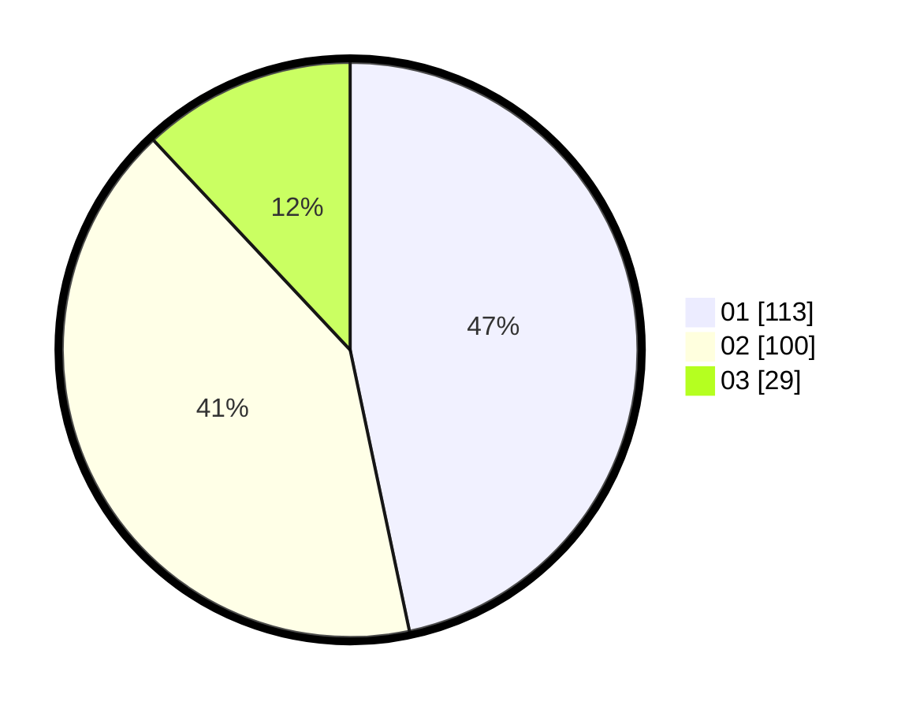

# Hasil

Hasil perolehan suara paslon dapat dilihat pada file paslon-01.txt, paslon-02.txt, dan paslon-03.txt.

Jika tidak ada, artinya data tersebut belum ada pada SIREKAP.

## Perolehan Suara

 * Paslon 01: **113**.
 * Paslon 02: **100**.
 * Paslon 03: **29**.

## Foto C Plano

https://sirekap-obj-formc.kpu.go.id/2c48/pemilu/ppwp/31/75/02/10/03/3175021003086-20240216-070732--c2f22605-1337-47da-b98d-fc32b745c465.jpg

https://sirekap-obj-formc.kpu.go.id/2c48/pemilu/ppwp/31/75/02/10/03/3175021003086-20240216-070734--9947b6ac-96b2-4786-ba43-914fa286a153.jpg

https://sirekap-obj-formc.kpu.go.id/2c48/pemilu/ppwp/31/75/02/10/03/3175021003086-20240216-070733--8f24df6c-91b0-4a00-a776-b7771142c570.jpg

## DATA PEMILIH TETAP

Jumlah pemilih dalam DPT: **289**.
 * L: **150**.
 * P: **139**.

## DATA PENGGUNA HAK PILIH

Jumlah pengguna hak pilih dalam DPT: **240**.
 * L: **117**.
 * P: **123**.

Jumlah pengguna hak pilih dalam DPTb: **2**.
 * L: **0**.
 * P: **2**.

Jumlah pengguna hak pilih dalam DPK: **1**.
 * L: **0**.
 * P: **1**.

Jumlah pengguna hak pilih: **243**.
 * L: **117**.
 * P: **126**.

## JUMLAH SUARA SAH DAN TIDAK SAH

JUMLAH SELURUH SUARA SAH: **242**.

JUMLAH SUARA TIDAK SAH: **1**.

JUMLAH SELURUH SUARA SAH DAN SUARA TIDAK SAH: **243**.
