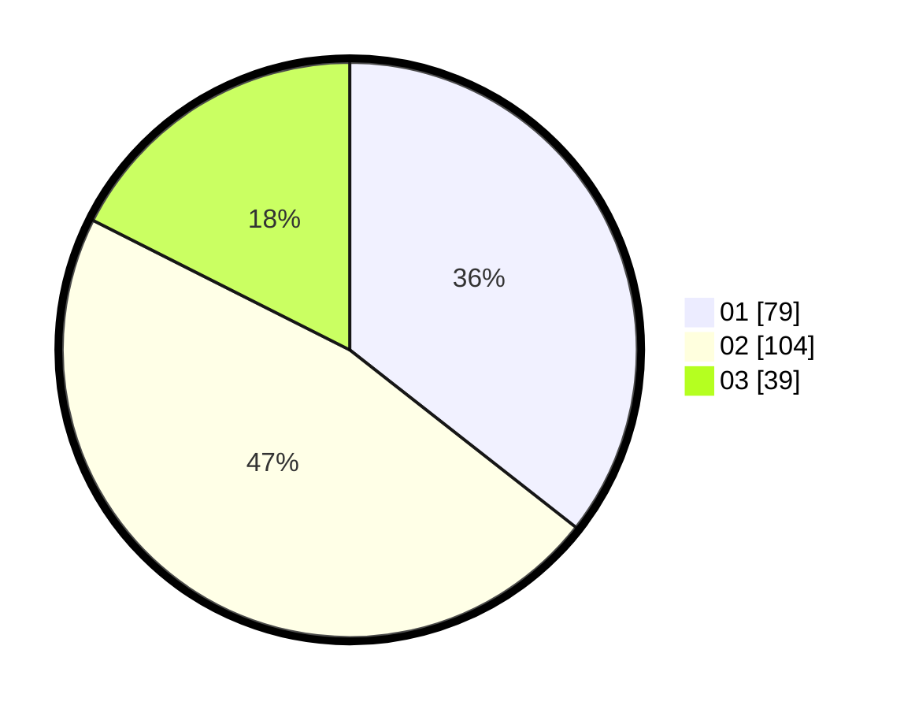

# Hasil

Hasil perolehan suara paslon dapat dilihat pada file paslon-01.txt, paslon-02.txt, dan paslon-03.txt.

Jika tidak ada, artinya data tersebut belum ada pada SIREKAP.

## Perolehan Suara

 * Paslon 01: **79**.
 * Paslon 02: **104**.
 * Paslon 03: **39**.

## Foto C Plano

https://sirekap-obj-formc.kpu.go.id/6ab5/pemilu/ppwp/31/75/02/10/03/3175021003087-20240214-234832--d1b5b3fa-0d36-4037-9ac6-b04e0fa72b76.jpg

https://sirekap-obj-formc.kpu.go.id/6ab5/pemilu/ppwp/31/75/02/10/03/3175021003087-20240214-234906--38c3fe87-d0b0-4858-ad2e-b1c1f4ec2491.jpg

https://sirekap-obj-formc.kpu.go.id/6ab5/pemilu/ppwp/31/75/02/10/03/3175021003087-20240214-235005--185eb025-1e55-45b1-bb32-545c3a239b4f.jpg
