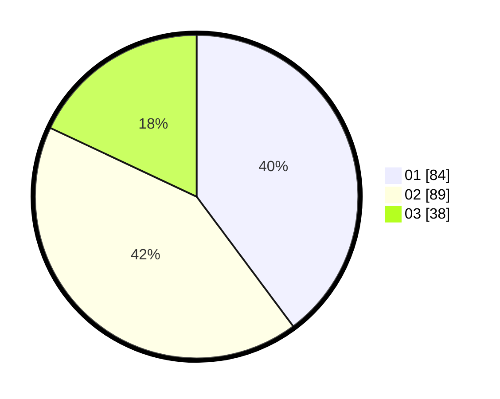

# Hasil

Hasil perolehan suara paslon dapat dilihat pada file paslon-01.txt, paslon-02.txt, dan paslon-03.txt.

Jika tidak ada, artinya data tersebut belum ada pada SIREKAP.

## Perolehan Suara

 * Paslon 01: **84**.
 * Paslon 02: **89**.
 * Paslon 03: **38**.

## Foto C Plano

https://sirekap-obj-formc.kpu.go.id/1d95/pemilu/ppwp/31/75/02/10/03/3175021003089-20240214-155554--2353c1bb-adc8-4cbd-adc0-a92f9f5381d8.jpg

https://sirekap-obj-formc.kpu.go.id/1d95/pemilu/ppwp/31/75/02/10/03/3175021003089-20240215-001621--921826c3-83ca-430d-876e-8d5d61f193a4.jpg

https://sirekap-obj-formc.kpu.go.id/1d95/pemilu/ppwp/31/75/02/10/03/3175021003089-20240214-155728--a74e42bd-b3f7-46eb-8c91-70a0518063f2.jpg
