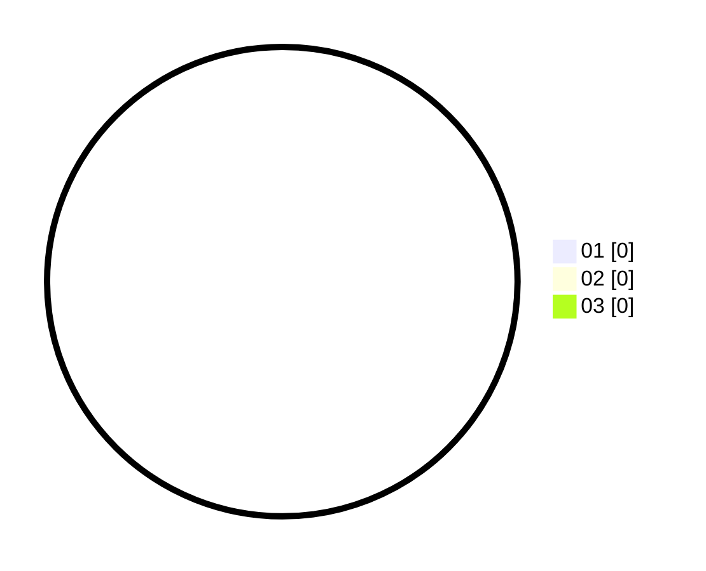

# Hasil

Hasil perolehan suara paslon dapat dilihat pada file paslon-01.txt, paslon-02.txt, dan paslon-03.txt.

Jika tidak ada, artinya data tersebut belum ada pada SIREKAP.

## Perolehan Suara

 * Paslon 01: **0**.
 * Paslon 02: **0**.
 * Paslon 03: **0**.

## Foto C Plano

https://sirekap-obj-formc.kpu.go.id/4043/pemilu/ppwp/31/75/02/10/03/3175021003093-20240214-204433--30342bdb-5059-4802-91e8-6bbbe5fe609c.jpg

https://sirekap-obj-formc.kpu.go.id/4043/pemilu/ppwp/31/75/02/10/03/3175021003093-20240214-204450--6c3f1167-9ec4-4e00-9abb-cc0d06c741dd.jpg

https://sirekap-obj-formc.kpu.go.id/4043/pemilu/ppwp/31/75/02/10/03/3175021003093-20240214-204505--c5a6dc04-fbd6-4d01-936d-fabc6ae5987d.jpg
